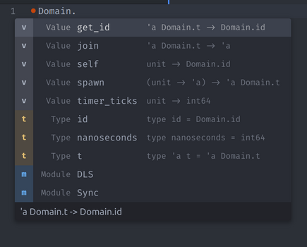
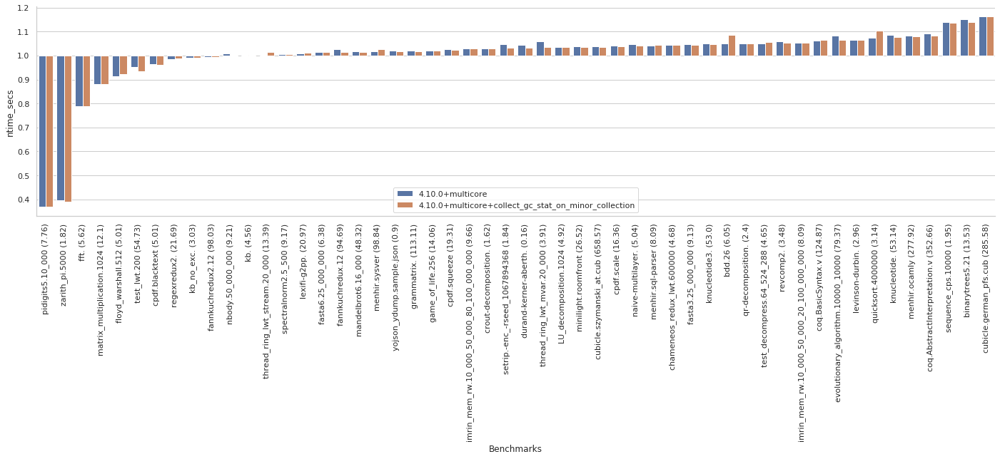

# Multicore OCaml: December 2020

Welcome to the December 2020 Multicore OCaml report! We encourage you
to review all the [previous
monthly](https://discuss.ocaml.org/tag/multicore-monthly) updates for
2020 which have been compiled by @shakthimaan, @kayceesrk, and @avsm.

This month has seen enhancements and updates to the ecosystem
libraries, with proposals and on-going discussions for improving
Multicore OCaml and Sandmark benchmark test suite. We have also
received useful feedback and testing from users in the community for
the latest Multicore OCaml code updates. We would like to thank:

+ @mattpallissard for getting `merlin` and `dot-merlin-reader` working
  with Multicore OCaml 4.10.
+ @eduardorfs for testing the `no-effect-syntax` Multicore OCaml
  branch with a Reason project.

@kayceesrk gave a couple of talks in this month:

+ [Research Seminars | Multicore OCaml - What's coming in
  20201](https://hopin.com/events/research-seminars-multicore-ocaml-coming-in-2021),
  Hosted by Nomadic Labs.
+ [Effect handlers in Multicore
  OCaml](https://kcsrk.info/slides/nus_effects.pdf). NUS PLV Research
  Seminar.

A number of major milestones were achieved in the Multicore OCaml
project in 2020. The major highlights include the implementation of
Eventlog tracing system, the rebasing of Multicore OCaml from 4.06 to
4.11, a chapter on Parallel Programming in Multicore OCaml, the
publication of `Retrofitting Parallelism onto OCaml` research paper at
ICFP 2020, upgrade of Sandmark benchmark test suite to use dune.2.6.0
with the build and addition of numerous performance benchmarks and
their dependencies, and the implementation of systhreads with
pthreads. As we finish the year strong, we look forward to 2021!

As with previous reports, the Multicore OCaml updates are listed first
for the month of December 2020, which are then followed by the
on-going efforts for the Sandmark benchmarking project. The upstream
OCaml ongoing work is finally mentioned for your reference.

## Multicore OCaml

### Ongoing

#### Ecosystem

* [ocaml-multicore/lockfree#6](https://github.com/ocaml-multicore/lockfree/issues/6)
  Current status and potential improvements
  
  An RFC that lists the current status of the `lockfree` library, and
  possible performance improvements for the Kcas dependency, test
  suite and benchmarks.

* [ocaml-multicore/lockfree#7](https://github.com/ocaml-multicore/lockfree/issues/7)
  Setup travis CI build
  
  A .travis.yml file, similar to the one in
  https://github.com/ocaml-multicore/domainslib/ needs to be created
  for the CI build system.

* [ocaml-multicore/effects-examples#20](https://github.com/ocaml-multicore/effects-examples/issues/20)
  Add WebServer example
  
  An open task to add the `httpaf` based webserver implementation to
  the effects-examples repository.

* [ocaml-multicore/effects-examples#21](https://github.com/ocaml-multicore/effects-examples/issues/21)
  Investigate CI failure
  
  The CI build fails on MacOS with a time out, but, it runs fine on
  Linux. An on-going investigation is pending.

* [ocaml-multicore/multicore-opam#39](https://github.com/ocaml-multicore/multicore-opam/issues/39)
  Multicore Merlin
  
  Thanks to @mattpallissard (Matt Pallissard) and @eduardorfs
  (Eduardo Rafael) for testing `merlin` and `dot-merlin-reader`, and
  to get it working with Multicore OCaml 4.10! The same has been
  tested with VSCode and Atom, and a screenshot of the UI is shown
  below:

  

#### API

* [ocaml-multicore/ocaml-multicore#448](https://github.com/ocaml-multicore/ocaml-multicore/issues/448)
  Reintroduce caml_stat_accessors in the C API
  
  The `caml_stat_minor_words`, `caml_stat_promoted_words`,
  `caml_allocated_words` `caml_stat_minor_collections` fields are not
  exposed in Multicore OCaml. This is a discussion to address possible
  solutions for the same.

* [ocaml-multicore/ocaml-multicore#459](https://github.com/ocaml-multicore/ocaml-multicore/pull/459)
  Replace caml_root API with global roots
  
  A work-in-progress to convert variables of type `caml_root` to
  `value`, and to register them as global root or generational global
  root, in order to remove the caml_root API entirely.

#### Sundries

* [ocaml-multicore/ocaml-multicore#450](https://github.com/ocaml-multicore/ocaml-multicore/issues/450)
  "rogue" systhreads and domain termination
  
  An RFC to discuss on the semantics of domain termination for
  non-empty thread chaining. In Multicore OCaml, a domain termination
  does not mean the end of a program, and slot reuse adds complexity
  to the implementation.

* [ocaml-multicore/ocaml-multicore#451](https://github.com/ocaml-multicore/ocaml-multicore/issues/451)
  Note for OCaml 5.0: Get rid of compatibility.h
  
  OCaml Multicore removed `modify` and `initialize` from
  `compatibility.h`, and this is a tracking issue to remove
  compatibility.h for OCaml 5.0.

* [ocaml-multicore/ocaml-multicore#458](https://github.com/ocaml-multicore/ocaml-multicore/pull/458)
  no-effect-syntax: Remove effects from typedtree
  
  The PR removes the the effect syntax use from `typedtree.ml`, and
  enables external applications that use the AST to work with
  domains-only Multicore OCaml.

* [ocaml-multicore/ocaml-multicore#461](https://github.com/ocaml-multicore/ocaml-multicore/pull/461)
  Remove stw/leader_collision events from eventlog
  
  A patch to make viewing and analyzing the logs better by removing
  the `stw/leader_collision` log messages.

### Completed

* [ocaml-multicore/effects-examples#23](https://github.com/ocaml-multicore/effects-examples/pull/23)
  Migrate to dune
  
  The build scripts were using OCamlbuild, and they have been ported
  to now use dune.

* [ocaml-multicore/ocaml-multicore#402](https://github.com/ocaml-multicore/ocaml-multicore/pull/402)
  Split handle_gc_interrupt into handling remote and polling sections
  
  The PR includes the addition of `caml_poll_gc_work` that contains
  the polling of GC work done in `caml_handle_gc_interrupt`. This
  facilitates handling of interrupts recursively without introducing
  new state.

* [ocaml-multicore/ocaml-multicore#439](https://github.com/ocaml-multicore/ocaml-multicore/pull/439)
  Systhread lifecycle work

  The improvement fixes a race condition in `caml_thread_scan_roots`
  when two domains are initializing, and rework has been done for
  improving general resource handling and freeing of descriptors and
  stacks.

* [ocaml-multicore/ocaml-multicore#446](https://github.com/ocaml-multicore/ocaml-multicore/pull/446)
  Collect GC stats at the end of minor collection

  The GC statistics is collected at the end of a minor collection, and
  the double buffering of GC sampled statistics has been removed. The
  change does not have an impact on the existing benchmark runs as
  observed against stock OCaml from the following illustration:

  

* [ocaml-multicore/ocaml-multicore#454](https://github.com/ocaml-multicore/ocaml-multicore/pull/454)
  Respect ASM_CFI_SUPPORTED flag in amd64
  
  The CFI directives in `amd64.S` are now guarded by
  `ASM_CFI_SUPPORTED`, and thus compilation with `--disable-cfi` will
  now provide a clean build.

* [ocaml-multicore/ocaml-multicore#455](https://github.com/ocaml-multicore/ocaml-multicore/pull/455)
  No blocking section on fork
  
  A patch to handle the case when a rogue thread attempts to take over
  the thread `masterlock` and to prevent a child thread from moving to
  an invalid state. Dune can now be used safely with Multicore OCaml.

## Benchmarking

### Ongoing

* [ocaml-bench/rungen#1](https://github.com/ocaml-bench/rungen/pull/1)
  Fix compiler warnings and errors for clean build
  
  The patch provides minor fixes for a clean build of `rungen` with dune
  to be used with Sandmark 2.0.

* [ocaml-bench/orun#2](https://github.com/ocaml-bench/orun/pull/2)
  Fix compiler warnings and errors for clean build

  The unused variables and functions have been removed to remove all
  the warnings and errors produced when building `orun` with dune.

* [ocaml-bench/sandmark#198](https://github.com/ocaml-bench/sandmark/issues/198)
  Noise in Sandmark
  
  An RFC to measure the noise between multiple execution runs of the
  benchmarks to better understand the performance with various
  hardware configuration settings, and with ASLR turned on and off.

* [ocaml-bench/sandmark#200](https://github.com/ocaml-bench/sandmark/pull/200)
  Global roots microbenchmark
  
  The patch includes `globroots_seq.ml`, `globroots_sp.ml`, and
  `globroots_mp.ml` that adds microbenchmarks to measure the
  efficiency of global root scanning.

* We are continuing to integrate the existing Sandmark benchmark test
  suite with a Sandmark 2.0 native dune build environment for use with
  opam compiler switch environment. The existing benchmarks have been
  ported to the same to use their respective dune files. The `orun`
  and `rungen` packages now live in separate GitHub repositories.

### Completed

* [ocaml-bench/sandmark#196](https://github.com/ocaml-bench/sandmark/pull/196)
  Filter benchmarks based on tag

  The benchmarks can now be filtered based on `tags` instead of custom
  target .json files. You can now build the benchmarks using the
  following commands:
  
  ```
  $ TAG='"run_in_ci"' make run_config_filtered.json 
  $ RUN_CONFIG_JSON=run_config_filtered.json make ocaml-versions/4.10.0+multicore.bench
  ```

* [ocaml-bench/sandmark#201](https://github.com/ocaml-bench/sandmark/pull/201)
  Fix compiler version in CI
  
  A minor update in .drone.yml to use
  `ocaml-versions/4.10.0+multicore.bench` in the CI for
  4.10.0+multicore+serial.

## OCaml

### Ongoing

* [ocaml/ocaml#9876](https://github.com/ocaml/ocaml/pull/9876)
  Do not cache young_limit in a processor register

  This PR for the removal of `young_limit` caching in a register for
  ARM64, PowerPC and RISC-V ports hardware is currently under review.

Our thanks to all the OCaml users and developers in the community for
their continued support and contribution to the project, and we look
forward to seeing you in 2021!

## Acronyms

* API: Application Programming Interface
* ARM: Advanced RISC Machine
* ASLR: Address Space Layout Randomization
* AST: Abstract Syntax Tree
* CFI: Call Frame Information
* CI: Continuous Integration
* GC: Garbage Collector
* ICFP: International Conference on Functional Programming
* JSON: JavaScript Object Notation
* OPAM: OCaml Package Manager
* PR: Pull Request
* RFC: Request For Comments
* RISC-V: Reduced Instruction Set Computing - V
* UI: User Interface
