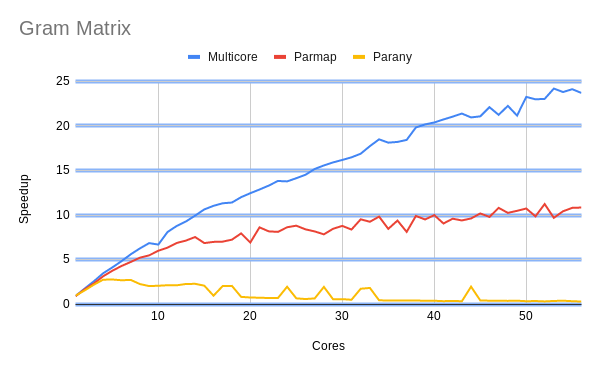

# Multicore OCaml: March 2020

Welcome to the March 2020 news update from the Multicore OCaml team!

Our work in the month of March was primarily focused on performance
improvements to the Multicore OCaml compiler for various
benchmarks. In this regard, a number of commits have been merged, and
we continue to add more and more benchmarks to the Sandmark test
suite. The Eventlog tracing system and use of hash table for
marshaling implementation Pull Requests (PR) with upstream OCaml are
in progress, and useful for the Multicore OCaml project.

The various ongoing and completed tasks for Multicore OCaml are listed
first, which is followed by the changes to the Sandmark benchmarking
infrastructure.

## Multicore OCaml

### Ongoing

* [ocaml-multicore/ocaml-multicore#240](https://github.com/ocaml-multicore/ocaml-multicore/pull/240)
  Proposed implementation of threads in terms of Domain and Atomic

  A new implementation of the Threads library for use with Domain and
  Atomic modules in Multicore OCaml has been proposed. This builds
  Dune 2.4.0 which in turn makes it useful to build other
  packages. This PR is open for review.

* [ocaml-multicore/safepoints-cmm-mach](https://github.com/anmolsahoo25/ocaml-multicore/tree/safepoints-cmm-mach)
  Better safe points for Ocaml

  A newer implementation to insert safe points at the Cmm level is
  being worked upon in this branch.

### Completed

The following PRs have been merged into Multicore OCaml:

* [ocaml-multicore/ocaml-multicore#303](https://github.com/ocaml-multicore/ocaml-multicore/pull/303)
  Account correctly for incremental mark budget

  The patch correctly measures the incremental mark budget value, and
  improves the maximum latency for menhir.ocamly benchmark.

* [ocaml-multicore/ocaml-multicore#307](https://github.com/ocaml-multicore/ocaml-multicore/pull/307)
  Put the phase change event in the actual phase change code

  The PR includes the `major_gc/phase_change` event in the appropriate context.

* [ocaml-multicore/ocaml-multicore#309](https://github.com/ocaml-multicore/ocaml-multicore/pull/309)
  Don't take all the full pools in one go

  The code change selects one of the `global_full_pools` to try
  sweeping it later, instead of adopting all of the full ones.

* [ocaml-multicore/ocaml-multicore#310](https://github.com/ocaml-multicore/ocaml-multicore/pull/310)
  Statistics for the current domain are more recent than other domains

  The statistics (minor_words, promoted_words, major_words,
  minor_collections) for the current domain are more recent, and are
  used in the right context.

* [ocaml-multicore/ocaml-multicore#315](https://github.com/ocaml-multicore/ocaml-multicore/pull/315)
  Writes in caml_blit_fields should always use caml_modify_field to
  record young_to_young pointers

  The PR enforces that `caml_modify_field()` is always used to store
  young_to_young pointers.

* [ocaml-multicore/ocaml-multicore#316](https://github.com/ocaml-multicore/ocaml-multicore/pull/316)
  Fix bug with Weak.blit

  The ephemerons are allocated as marked, but, the keys or data can be
  unmarked. The blit operations copy weak references from one
  ephemeron to another without marking them. The patch marks the keys
  that are blited in order to keep the unreachable keys alive for
  another major cycle.

* [ocaml-multicore/ocaml-multicore#317](https://github.com/ocaml-multicore/ocaml-multicore/pull/317)
  Return early for 0 length blit

  The PR forces a `CAMLreturn()` call if the blit length is zero in
  byterun/weak.c.

* [ocaml-multicore/ocaml-multicore#320](https://github.com/ocaml-multicore/ocaml-multicore/pull/320)
  Move num_domains_running decrement

  The `caml_domain_alone()` invocation needs to be used in the shared
  heap teardown, and hence the `num_domains_running` decrement is moved
  as the last operation for at least the shared_heap lockfree fast
  paths.

## Benchmarking

The [Sandmark](https://github.com/ocaml-bench/sandmark) performance
benchmarking test suite has had newer benchmarks added, and work is
underway to enhance its functionality.

* [ocaml-bench/sandmark#88](https://github.com/ocaml-bench/sandmark/pull/88)
  Add PingPong Multicore benchmark

  The PingPong benchmark that uses producer and consumer queues has
  now been included into Sandmark.

* [ocaml-bench/sandmark#98](https://github.com/ocaml-bench/sandmark/pull/98)
  Add the read/write Irmin benchmark

  A basic read/write file performance benchmark for Irmin has been
  added to Sandmark. You can vary the following input parameters:
  number of branches, number of keys, percentage of reads and writes,
  number of iterations, and the number of write operations.

* [ocaml-bench/sandmark#100](https://github.com/ocaml-bench/sandmark/issues/100)
  Add Gram Matrix benchmark

  A request
  [ocaml-bench/sandmark#99](https://github.com/ocaml-bench/sandmark/issues/99)
  to include the Gram Matrix initialization numerical benchmark was
  created. This is useful for machine learning applications and is now
  available in the Sandmark performance benchmark suite. The speedup
  (sequential_time/multi_threaded_time) versus number of cores for
  Multicore (Concurrent Minor Collector), Parmap and Parany is quite
  significant and illustrated in the graph:

  

* [ocaml-bench/sandmark#103](https://github.com/ocaml-bench/sandmark/pull/103)
  Add depend target in Makefile

  Sandmark now includes a `depend` target defined in the Makefile to
  check that both `libgmp-dev` and `libdw-dev` packages are installed
  and available on Ubuntu.

* [ocaml-bench/sandmark#90](https://github.com/ocaml-bench/sandmark/issues/90)
  More parallel benchmarks

  An issue has been created to add more parallel benchmarks. We will
  use this to keep track of the requests. Please feel free to add your
  wish list of benchmarks!

## OCaml

### Ongoing

* [ocaml/ocaml#9082](https://github.com/ocaml/ocaml/pull/9082) Eventlog tracing system

  The configure script has now been be updated so that it can build on
  Windows. Apart from this major change, a number of minor commits
  have been made for the build and sanity checks. This PR is currently
  under review.

* [ocaml/ocaml#9353](https://github.com/ocaml/ocaml/pull/9353)
  Reimplement output_value using a hash table to detect sharing

  The [ocaml/ocaml#9293](https://github.com/ocaml/ocaml/pull/9293)
  `Use addrmap hash table for marshaling` PR has been re-implemented
  using a hash table and bit vector, thanks to Xavier Leroy. This is a
  pre-requisite for Multicore OCaml that uses a concurrent garbage
  collector.

We thank the OCaml developers and users in the community for their
code reviews, support, and contribution to the project.
