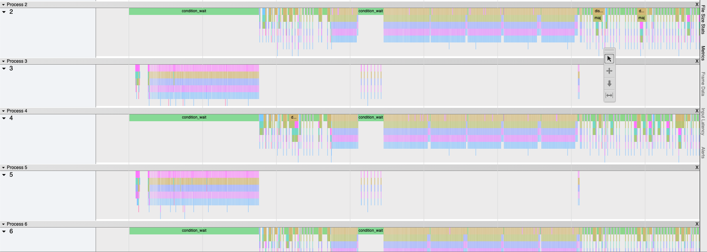
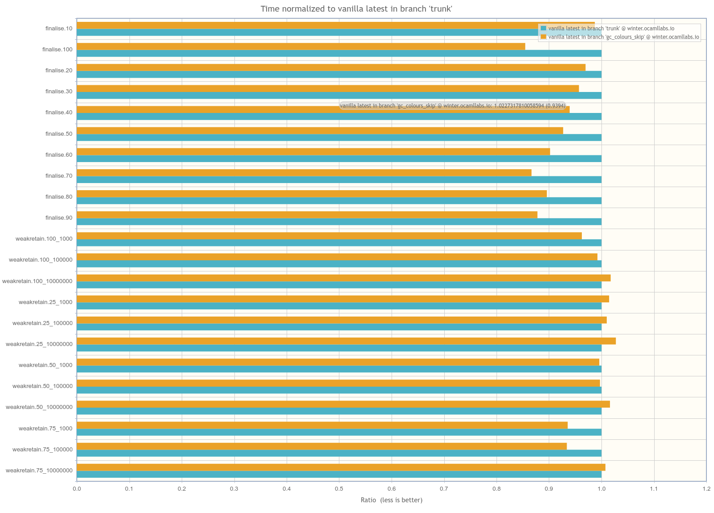

# Multicore OCaml: September 2020

Welcome to the September 2020 Multicore OCaml report! This update
along with the [previous
monthly](https://discuss.ocaml.org/tag/multicore-monthly) updates have
been compiled by @shakthimaan, @kayceesrk and @avsm.

The implementation of pthreads for Multicore OCaml has made progress
with further reviews and comments. A number of performance
improvements to Multicore OCaml and the Sandmark benchmarking project
have been completed. We have now included the Kronecker implementation
from the Graph500 benchmarks to Sandmark, and an `n queen` benchmark
addition is in progress. The benchmark runs now provide a count of the
CAML symbols as a code size metric.

A number of new initiatives have been started in the month of
September 2020. The [porting of
Lwt](https://github.com/Sudha247/lwt-multicore/tree/preemptive-multicore)
to take advantage of parallelism, and to use multiple domains is
underway. [Code samples](https://github.com/Sudha247/code-samples/)
and test runs have been performed to measure the same. The work on
building Tezos with Multicore OCaml, and integration with the Sandmark
benchmarking test suite has also begun.

As with the previous updates, the Multicore OCaml updates are first
listed, which are then followed by the enhancements to the Sandmark
benchmarking project. The upstream OCaml ongoing and completed updates
are finally mentioned for your reference.

## Multicore OCaml

### Ongoing

* [ocaml-multicore/domainslib#17](https://github.com/ocaml-multicore/domainslib/pull/17)
  Implement channels using Mutex and Condition Variables

  The `lib/chan.ml` sources have been updated to implement channels
  using Mutex and Condition Variables, and a
  `LU_decomposition_multicore.exe` test has been added for the same.

* [ocaml-multicore/ocaml-multicore#381](https://github.com/ocaml-multicore/ocaml-multicore/pull/381)
  Reimplementating systhreads with pthreads

  This PR is actively being reviewed for the use of `pthreads` in
  Multicore OCaml. It introduces the Domain Execution Contexts (DEC)
  which allows multiple threads to run atop a domain.

* [ocaml-multicore/ocaml-multicore#394](https://github.com/ocaml-multicore/ocaml-multicore/pull/394)
  Changes to polling placement

  The polls placement is done at the start of the functions and on the
  back-edge of loops, instead of using Feely's algorithm. This is a
  work-in-progress.

* [ocaml-multicore/ocaml-multicore#401](https://github.com/ocaml-multicore/ocaml-multicore/pull/401)
  Do not handle interrupts recursively

  A domain local variable is introduced to prevent handling of
  interrupts recursively.

* [ocaml-multicore/ocaml-multicore#402](https://github.com/ocaml-multicore/ocaml-multicore/pull/402)
  Split handle_gc_interrupt into handling remote and polling sections

  A `caml_poll_gc_work` is introduced that has information of GC work
  done previously in `caml_handle_gc_interrupt`. This facilitates
  `stw_handler` to make calls to poll and not handle service
  interrupts, as it may lead to unwanted recursion.

* [ocaml-multicore/ocaml-multicore#403](https://github.com/ocaml-multicore/ocaml-multicore/issues/403)
  Segmentation fault when building Tezos on Multicore 4.10.0 with no-effects-syntax

  This is an on-going investigation on why the package
  `tezos-embedded-protocol-packer` in Tezos is causing a segmentation
  fault when building with Multicore OCaml.

### Completed

#### Domainslib

* [ocaml-multicore/domainslib#19](https://github.com/ocaml-multicore/domainslib/pull/19)
  Finer grain signalling with mutex condvar for Channels

  The use of fine grain locking for Mutex and condition variables
  helps in improving the performance for larger cores, as against a
  single mutex for all the signalling.

#### Multicore OPAM

* [ocaml-multicore/multicore-opam#31](https://github.com/ocaml-multicore/multicore-opam/pull/31)
  Patch dune.2.7.1 for Multicore OCaml

  The opam file for dune.2.7.1 has been added along with a patch to
  `bootstrap.ml` to get it working for Multicore OCaml, thanks to
  Chaitanya Koparkar.

* [ocaml-multicore/multicore-opam#32](https://github.com/ocaml-multicore/multicore-opam/pull/32)
  Add ocamlfind-secondary dependency to dune

  The installation of `dune` requires `ocamlfind-secondary` as a
  dependency for dune.2.7.1, and has been added to the OPAM file.

#### Multicore OCaml

* [ocaml-multicore/ocaml-multicore#395](https://github.com/ocaml-multicore/ocaml-multicore/pull/395)
  Move to SPIN_WAIT for all spins and usleep in SPIN_WAIT

  The PR provides the SPIN_WAIT macro for all the busy spin wait
  loops, and uses `caml_plat_spin_wait` when busy waiting. This
  ensures that the same spin strategy is used in different places in
  the code.

* [ocaml-multicore/ocaml-multicore#397](https://github.com/ocaml-multicore/ocaml-multicore/pull/397)
  Relaxation of backup thread signalling

  The signalling to the backup thread from the mutator thread when
  leaving a blocking section is modified. It reduces the potential
  Operating System scheduling when re-entering OCaml.

* [ocaml-multicore/ocaml-multicore#400](https://github.com/ocaml-multicore/ocaml-multicore/pull/400)
  Demux eventlog for backup thread

  The events in the backup thread were emitting the same process ID as
  the main thread, and this PR separates them.

  

  In the above illustration, the backup threads are active when the
  main thread is waiting on a condition variable.

## Benchmarking

### Ongoing

* [ocaml-bench/sandmark#159](https://github.com/ocaml-bench/sandmark/issues/159)
  Implement a better way to describe tasklet cpulist

  We need a cleaner way to obtain the taskset list of cores for a
  benchmark run when we are provided with a number of domains. We
  should be able to specify hyper-threaded cores, NUMA zones to use,
  and the specific cores to use for the parallel benchmarks.

* [ocaml-bench/sandmark#173](https://github.com/ocaml-bench/sandmark/pull/173)
  Addition of nqueens benchmark to multicore-numerical

  A draft version of the classical `n queens` benchmark has been added
  for review in Sandmark. This includes both the single and multicore
  implementation.

### Completed

* [ocaml-bench/ocaml_bench_scripts#11](https://github.com/ocaml-bench/ocaml_bench_scripts/pull/11)
  Add support for configure option and OCAMLRUNPARAM

  The `ocaml_bench_scripts` has been updated to support passing
  `configure` options and OCAMLRUNPARAM when building and running the
  benchmarks in Sandmark.

* [ocaml-bench/sandmark#122](https://github.com/ocaml-bench/sandmark/issues/122)
  Measurements of code size

  The output .bench JSON file produced from the benchmarks now
  includes a code size metric for the number of CAML symbols. A sample
  benchmark output is shown below:

  ```
  {"name":"knucleotide.", ... ,"codesize":276859.0, ...}
  ```

  The code size count for few of the benchmarks is given below:

  ```
  | Benchmark  |   Count   |
  |------------|-----------|
  | alt-ergo   | 2_822_040 |
  | coqc       | 5_869_305 |
  | cpdf       | 1_131_376 |
  | nbody.exe  |   276_710 |
  | stress.exe |    84_061 |
  | fft.exe    |    38_914 |
  ```

* [ocaml-bench/sandmark#170](https://github.com/ocaml-bench/sandmark/pull/170)
  Graph500 SEQ

  The Graph500 benchmark with a Kronecker graph generator has now been
  added to Sandmark. The generator builds three kernels for graph
  construction, Breadth First Search, and Single Source Shortest
  Paths.

* [ocaml-bench/sandmark#172](https://github.com/ocaml-bench/sandmark/pull/172)
  Remove `Base`, `Stdio` orun dependency for trunk

  The `orun` sources in Sandmark have been updated to remove the
  dependency on both `Base` and `Stdio`. They have been replaced with
  functions from `Stdlib`, `List`, `String` and `Str`.

* [ocaml-bench/sandmark#174](https://github.com/ocaml-bench/sandmark/pull/174)
  Cleanup our use of sudo for chrt

  The use of `sudo` has been removed from the Makefile for running
  parallel benchmarks, to avoid creating output files and directories
  that require root permissions for access. The use of
  `RUN_BENCH_TARGET=run_orunchrt` will execute the benchmarks using
  `chrt -r 1`. The user can give permissions to the `chrt` binary
  using:

  ```
  $ sudo setcap cap_sys_nice=ep /usr/bin/chrt
  ```

## OCaml

### Ongoing

* [ocaml/ocaml#9876](https://github.com/ocaml/ocaml/pull/9876)
  Do not cache young_limit in a processor register

  The PR removes the caching of `young_limit` in a register for ARM64,
  PowerPC and RISC-V ports, as it is problematic during polling for
  signals and inter-domain communication in Multicore OCaml.

### Completed

* [ocaml/ocaml#9756](https://github.com/ocaml/ocaml/pull/9756)
  Garbage collectors colour change

  The gray colour scheme in the Garbage Collector has been removed to
  facilitate merging with the Multicore OCaml collector. The existing
  benchmarks in Sandmark suite that did overflow the mark stack are
  show in the below illustration, and there is little negative impact
  on the change.

  

We would like to thank all the OCaml developers and users in the
community for their continued support and contribution to the project.

## Acronyms

* ARM: Advanced RISC Machine
* BFS: Breadth First Search
* DEC: Domain Execution Context
* GC: Garbage Collector
* JSON: JavaScript Object Notation
* NUMA: Non-Uniform Memory Access
* OPAM: OCaml Package Manager
* OS: Operating System
* PR: Pull Request
* RISC-V: Reduced Instruction Set Computing - V
* SSSP: Single Source Shortest Path
