# Multicore OCaml: August 2021

Welcome to the August 2021 [Multicore
OCaml](https://github.com/ocaml-multicore/ocaml-multicore) monthly
report! The following update and the [previous
update's](https://discuss.ocaml.org/tag/multicore-monthly) have been
compiled by @avsm, @ctk21, @kayceesrk and @shakthimaan.

We have been working very hard during the pandemic and hence our
employers have given us a mandatory two-week (fully paid) rest
period. August is also a period of downtime in Europe, but, we have
actively participated in the International Conference on Functional
Programming (ICFP) which was held virtually this year between August
22-27, 2021.

As always, the Multicore OCaml updates are listed first, which are
then followed by the updates from the Ecosystem libraries and Sandmark
benchmarking. Finally, the ICFP relevant blog posts and videos from
the OCaml workshop sessions are provided for your reference.

## Multicore OCaml

* [ocaml-multicore/ocaml-multicore#632](https://github.com/ocaml-multicore/ocaml-multicore/issues/632)
  Str module multi domain safety
  
  An issue on stdlib safety in the OCaml `Str` module to work
  concurrently with Multicore OCaml.

* [ocaml-multicore/ocaml-multicore#633](https://github.com/ocaml-multicore/ocaml-multicore/issues/633)
  Error building 4.12.0+domains with no-flat-float-arrays
  
  A linker error observed by `Adrián Montesinos González` (`debugnik`)
  when installing 4.12.0+domains `no-flat-float-arrays`.
  
* [ocaml-multicore/ocaml-multicore#634](https://github.com/ocaml-multicore/ocaml-multicore/issues/634)
  Strange type errors from merlin (This expression has type string/1)
  
  Type errors reported from merlin (4.3.1-412) when using the effects
  version of the Multicore OCaml compiler.

* [ocaml-multicore/ocaml-multicore#624](https://github.com/ocaml-multicore/ocaml-multicore/issues/624)
  core v0.14: test triggers a segfault in the GC
  
  The root cause of the segfault when running `core.v0.14` test suite
  with Multicore OCaml 4.12.0+domains has been identified.

* [ocaml-multicore/ocaml-multicore#573](https://github.com/ocaml-multicore/ocaml-multicore/pull/573)
  Backport trunk safepoints PR to multicore

  This is an on-going effort to backport the Safepoints implementation to Multicore OCaml.

## Ecosystem

### Ongoing

* [ocaml-multicore/parallel-programming-in-multicore-ocaml#10](https://github.com/ocaml-multicore/parallel-programming-in-multicore-ocaml/pull/10)
  Edited for flow/syntax/consistency
  
  The Parallel Programming in Multicore OCaml chapter has been updated
  for consistency, syntax flow and grammar.

* [ocaml-multicore/retro-httpaf-bench#15](https://github.com/ocaml-multicore/retro-httpaf-bench/pull/15)
  Optimise Go code

  The `nethttp-go/httpserv.go` benchmark has been optimised with use
  of `Write` instead of `fmt.Fprintf`, and the removal of yield().

  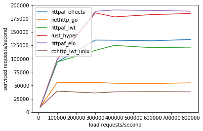

* [ocaml-multicore/ocaml-uring#37](https://github.com/ocaml-multicore/ocaml-uring/issues/37)
  `poll_add` test hangs on s390x
  
  The use of `poll_add` causes a hang on `s390x` architecture. A
  backtrace with GDB is provided for reference:
  
  ```
  (gdb) bt
   #0  0x000003ffb63ec01e in __GI___libc_write (nbytes=<optimized out>, buf=<optimized out>, fd=<optimized out>)
       at ../sysdeps/unix/sysv/linux/write.c:26
   #1  __GI___libc_write (fd=<optimized out>, buf=0x3ffffdee8e0, nbytes=1) at ../sysdeps/unix/sysv/linux/write.c:24
   #2  0x000002aa0dbb0ca2 in unix_write (fd=<optimized out>, buf=<optimized out>, vofs=<optimized out>, vlen=<optimized out>) at write.c:44
   #3  0x000002aa0dbd4d3a in caml_c_call ()
  
  ```

* [ocaml-multicore/domainslib#37](https://github.com/ocaml-multicore/domainslib/issues/37)
  parallel_map

  `UnixJunkie` has provided a simplified version for the interface for
  scientific parallel programming as recommended by the parany library.
  
  ```
  val run:
  ?csize:int ->
  ~nprocs: int ->
  demux:(unit -> 'a) ->
  work:('a -> 'b) ->
  mux:('b -> unit) -> unit
  ```

* [ocaml-multicore/domainslib#39](https://github.com/ocaml-multicore/domainslib/pull/39)
  Add a fast path in parallel scan
  
  A patch that performs a sequential scan when the number of elements
  is less than or equal to the pool size or if the number of domains
  is one.

* [ocaml-multicore/domainslib#40](https://github.com/ocaml-multicore/domainslib/pull/40)
  Parallel map
  
  A PR that implements `parallel_map` in lib/task.ml that includes an
  optional chunk size parameter.

### Completed

* [ocaml-multicore/retro-httpaf-bench#13](https://github.com/ocaml-multicore/retro-httpaf-bench/pull/13)
  Update EIO for performance improvements, multiple domains
  
  `httpf-eio` has been enhanced with performance improvements when
  running with multiple domains. The results on an 8-core VM with 100
  connections and 5 second runs is shown below:

  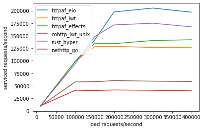

  The following illustration is from a VM for 1000 connections and 60
  second runs:

  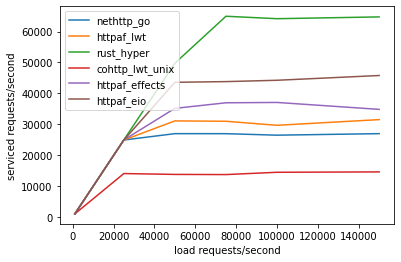

  The results with `GOMAXPROCS=3` for three OCaml domains is as follows:
  
  

* [ocaml-multicore/ocaml-uring#36](https://github.com/ocaml-multicore/ocaml-uring/pull/36)
  Update to cstruct 6.0.1
  
  `ocaml-uring` now uses `Cstruct.shiftv` and has been updated to use
  cstruct.6.0.1.

* [ocaml-multicore/domainslib#41](https://github.com/ocaml-multicore/domainslib/pull/41)
  Use the master branch in the link to usage examples
  
  The README.md file has been updated to point to the sample programs
  in the master branch that use the new `num_additional_domains`
  argument label.

* The Multicore OCaml concurrency bug detection tool named
  [ParaFuzz](https://github.com/ocaml-multicore/parafuzz) is made
  available in GitHub as Free/Libre and Open Source Software.

* Tezos is a distributed consensus platform like Bitcoin or
  Ethereum. The version of the
  [Tezos](https://github.com/ocaml-multicore/tezos) that now runs on
  Multicore OCaml is also now available in GitHub.

#### Eio

The `eio` library provides an effects-based parallel IO stack for
Multicore OCaml.

##### Completed

* [ocaml-multicore/eio#68](https://github.com/ocaml-multicore/eio/pull/68)
  Add eio_luv backend
  
  We now use `luv`, which has OCaml/Reason bindings to libuv, to
  provide a cross-platform default backend for eio.

* [ocaml-multicore/eio#72](https://github.com/ocaml-multicore/eio/pull/72)
  Add non-deterministic to abstract domain socket test
  
  The inclusion of `non-deterministic=command` to disable a regular
  `dune runtest` for the failing abstract domain socket test.

* [ocaml-multicore/eio#73](https://github.com/ocaml-multicore/eio/pull/73)
  Work-around for `io_uring` bug reading from terminals
  
  A work-around to fix `IORING_OP_READ` that causes `io_uring_enter`
  to block the entire process when reading from a terminal.

* [ocaml-multicore/eio#74](https://github.com/ocaml-multicore/eio/pull/74)
  Don't crash when receiving a signal
  
  A patch to receive a signal and not crash in
  `lib_eio_linux/eio_linux.ml`.

* [ocaml-multicore/eio#75](https://github.com/ocaml-multicore/eio/pull/75)
  Add Eio.Stream
  
  The `Stream` module has been added to Eio that implements bounded
  queues with cancellation.

* [ocaml-multicore/eio#76](https://github.com/ocaml-multicore/eio/pull/76)
  Link to some eio examples

  The README.md has been updated to point to existing eio example
  project sources.

* [ocaml-multicore/eio#77](https://github.com/ocaml-multicore/eio/pull/77)
  Disable opam file generation due to dune bug
  
  The opam file generation with dune.2.9.0 is broken as dune does not
  have the `subst --root` option. Hence, the same is now disabled in
  the eio build steps.

* [ocaml-multicore/eio#79](https://github.com/ocaml-multicore/eio/pull/79)
  Initial edits for consistency, formatting and clarity
  
  Changes in the README.md file for consistency, syntax formatting and
  for clarity.

## Benchmarking

### Sandmark

* [ocaml-bench/sandmark#251](https://github.com/ocaml-bench/sandmark/pull/251)  
  Update dependencies to work with 4.14.0+trunk
  
  A series of patches that update the dependencies in Sandmark to
  build 4.14.0+trunk with dune.2.9.0.

* We are continuing to integrate and test building of 4.12.0 OCaml
  variants with Sandmark-2.0 with `current-bench` for both sequential
  and parallel benchmarks.

## International Conference on Functional Programming 2021

We have presented talks at the International Conference on Functional
Programming (ICFP) 2021 that was held virtually in August 2021.

A couple of related blog posts that were published at the Tarides and
the Segfault Systems web sites are as follows:

1. [Tarides Engineers to Present at ICFP 2021](https://tarides.com/blog/2021-08-26-tarides-engineers-to-present-at-icfp-2021)

2. [Adapting the OCaml Ecosystem for Multicore OCaml](http://segfault.systems/blog/2021/adapting-to-multicore/)

The OCaml Workshop was conducted on Friday, August 27, 2021 at the
conference and the videos of the talks are now available in YouTube
and at [watch.ocaml.org](https://watch.ocaml.org).

* GopCaml A structural Editor for OCaml

  [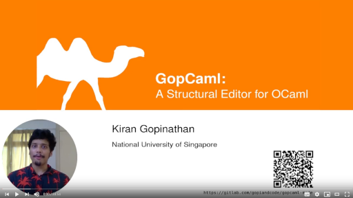](https://www.youtube.com/watch?v=KipRuiLXYEo)

* OCaml and Python getting the best of both worlds

  [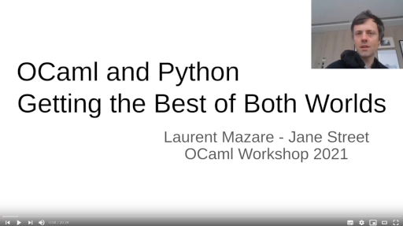](https://www.youtube.com/watch?v=ZseAgG9kmMw)

* Adapting the OCaml ecosystem for Multicore OCaml

  [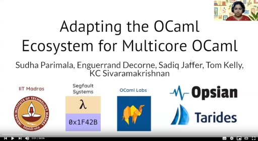](https://www.youtube.com/watch?v=MfjMpznU4nM)

* Parafuzz coverage guided Property Fuzzing for Multicore OCaml programs

  [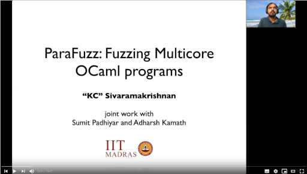](https://www.youtube.com/watch?v=GZsUoSaIpIs)

* Wibbily Wobbly Timey Camly

  [](https://www.youtube.com/watch?v=3Jpla-vWLR4)

* Leveraging Formal Specifications to Generate Fuzzing Suites

  [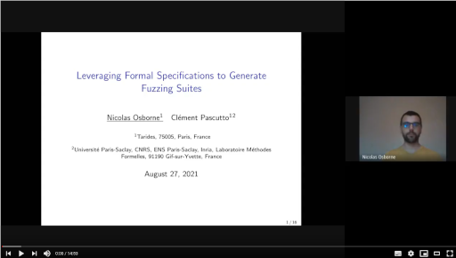](https://www.youtube.com/watch?v=-6fpLF_n7cA)

* Probabilistic resource limits using StatMemprof

  [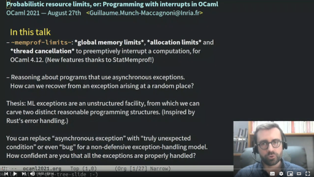](https://www.youtube.com/watch?v=9OES0qe_OvE)

* Continuous Benchmarking for OCaml Projects

  [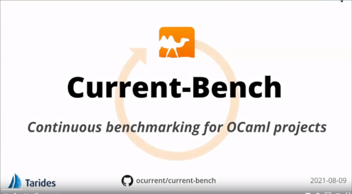](https://www.youtube.com/watch?v=folKaWN7jy4)

* A Multiverse of Glorious Documentation

  [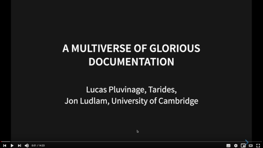](https://www.youtube.com/watch?v=qUMbbKwagaU)

* Digodoc and Docs

  [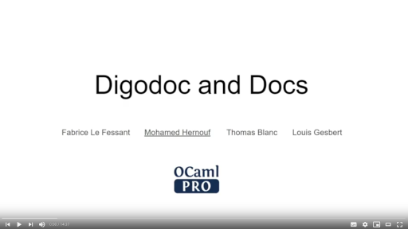](https://www.youtube.com/watch?v=gODavKhyd2I)

* Keynote - Xavier Leroy: 25 years of OCaml

  [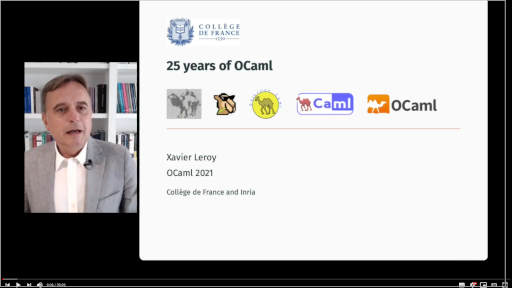](https://www.youtube.com/watch?v=PGJdHUqgX7o)

* Experiences with Effects

  [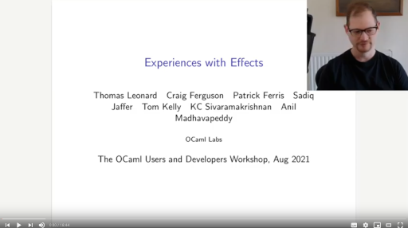](https://www.youtube.com/watch?v=k3oQwpyXmpo)

* opam-bin Binary Packages with Opam

  [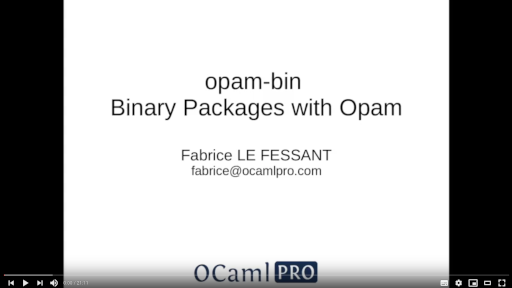](https://www.youtube.com/watch?v=vadoOkgEs6w)

* Love a readable language interpreted by blockchain

  [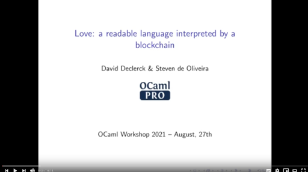](https://www.youtube.com/watch?v=um55QNwz8o4)

* From 2n+1 to n

  [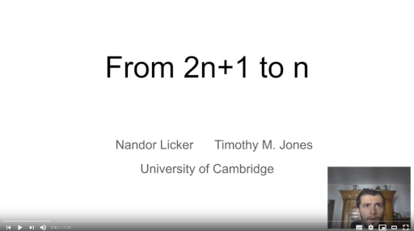](https://www.youtube.com/watch?v=3xRGeJSslPE)

* Property based testing for OCaml through Coq

  [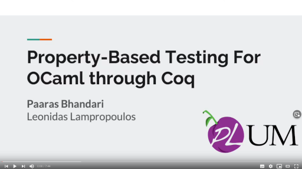](https://www.youtube.com/watch?v=w-dTTlVwVgY)

* Safe protocol updates via propositional logic

  [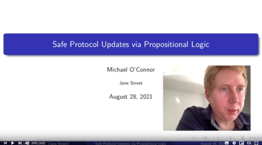](https://www.youtube.com/watch?v=ckN1YREM3Gk)

* Binary Analysis Program (BAP)

  [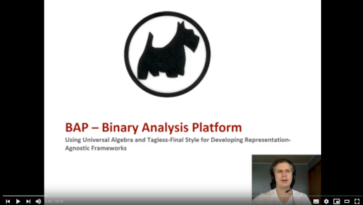](https://www.youtube.com/watch?v=S9XPI1fHWqM)

* Semgrep a fast lightweight polyglot static analysis tool to find bugs

  [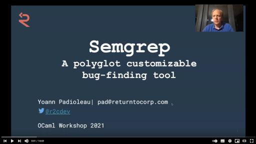](https://www.youtube.com/watch?v=q7kuvyAOk78)

Our thanks to all the OCaml users, developers and contributors in the
community for their valuable time and support to the project. Stay
safe!

## Acronyms

* GC: Garbage Collector
* GDB: GNU Project Debugger
* HTTP: Hypertext Transfer Protocol
* ICFP: International Conference on Functional Programming
* IO: Input/Output
* PR: Pull Request
* OPAM: OCaml Package Manager
* VM: Virtual Machine

