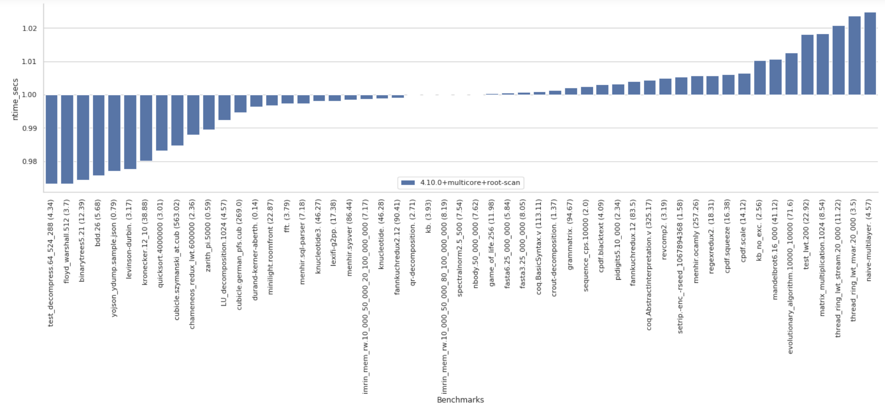
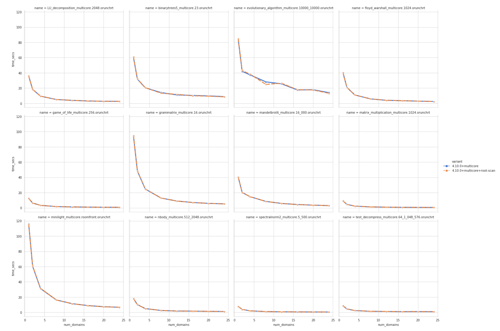
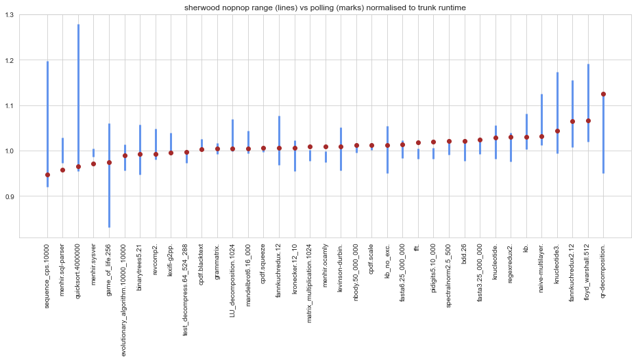
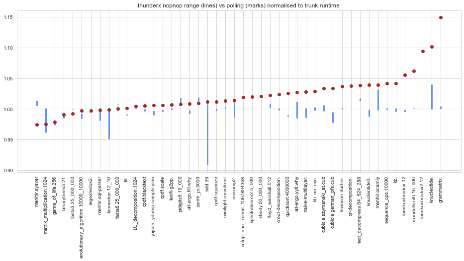

# Multicore OCaml: January 2021

Welcome to the January 2021 [Multicore
OCaml](https://github.com/ocaml-multicore/ocaml-multicore) monthly
report. Many thanks to @avsm, @kayceesrk and @shakthimaan for
collating the updates for the first month in the New Year! As with the
[previous year's](https://discuss.ocaml.org/tag/multicore-monthly)
reports, we will continue to provide monthly updates for the benefit
of the community!

The work on the design and implementation of Domain-Local Allocation
Buffers (DLAB) for Multicore OCaml has begun in January 2021. The
Multicore Merlin support is now merged, thanks to @mattpallissard and
@eduardorfs. We continue to work on the enhancements for Sandmark 2.0
benchmarking suite for an upcoming alpha release. The improvements to
the Safepoints implementation have also been submitted for review.

The Multicore OCaml updates are first listed, which are then followed
by improvements to the Sandmark benchmarking project. Finally, the
changes made to upstream OCaml which include both the ongoing and
completed tasks are mentioned for your reference.

## Multicore OCaml

### Ongoing

* [ocaml-multicore/ocaml-multicore#464](https://github.com/ocaml-multicore/ocaml-multicore/pull/464)
  Replace Field_imm with Field
  
  The patch replaces the Field immediate use with Field from the
  concurrent minor collector.

* [ocaml-multicore/ocaml-multicore#468](https://github.com/ocaml-multicore/ocaml-multicore/issues/468)
  Finalisers causing segfault with multiple domains
  
  An on-going test case where Finalisers cause segmentation faults
  with multiple domains.

* The design and implementation of Domain-Local Allocation Buffers
  (DLAB) is underway, and the relevant notes on the same are available
  in the following [DLAB
  Wiki](https://github.com/ocaml-multicore/ocaml-multicore/wiki/Domain-Local-Allocation-Buffers).

### Completed

#### Ecosystem

* [ocaml-bench/rungen#1](https://github.com/ocaml-bench/rungen/pull/1)
  Fix compiler warnings and errors for clean build
  
  Minor fixes for a clean build of `rungen` with dune to be used with
  Sandmark 2.0.

* [ocaml-bench/orun#2](https://github.com/ocaml-bench/orun/pull/2)
  Fix compiler warnings and errors for clean build

  A patch to remove unused variables and functions without any
  warnings and errors when building `orun` with dune.

* [ocaml-bench/rungen#2](https://github.com/ocaml-bench/rungen/pull/2)
  Added meta files for dune-release lint
  
  The `dune-release lint` checks for rungen now pass with the
  inclusion of CHANGES, LICENSE and updates to rungen.opam files.

* [ocaml-bench/orun#3](https://github.com/ocaml-bench/orun/pull/3)
  Add meta files for dune-release lint

  The CHANGES, LICENSE, README.md and orun.opam files have been added
  to prepare the sources for an opam.ocaml.org release.

* [ocaml-multicore/multicore-opam#39](https://github.com/ocaml-multicore/multicore-opam/issues/39)
  Multicore Merlin
  
  Thanks to @mattpallissard (Matt Pallissard) and @eduardorfs (Eduardo
  Rafael) for testing `merlin` and `dot-merlin-reader`, and to get it
  working with Multicore OCaml 4.10! The changes work fine with VSCode
  and Atom. The corresponding
  [PR#40](https://github.com/ocaml-multicore/multicore-opam/pull/40)
  is now merged.

* [ocaml-multicore/ocaml-multicore#45](https://github.com/ocaml-multicore/multicore-opam/pull/45)
  Merlin and OCaml-LSP installation instructions
  
  The README.md file has been updated to include installation
  instructions to use Merlin and OCaml LSP Server.

#### Sundries

* [ocaml-multicore/ocaml-multicore#458](https://github.com/ocaml-multicore/ocaml-multicore/pull/458)
  no-effect-syntax: Remove effects from typedtree
  
  The PR enables external applications that use the AST to work with
  domains-only Multicore OCaml, and removes the effect syntax use from
  `typedtree.ml`.

* [ocaml-multicore/ocaml-multicore#461](https://github.com/ocaml-multicore/ocaml-multicore/pull/461)
  Remove stw/leader_collision events from eventlog
  
  The `stw/leader_collision` log messages have been cleaned up to make
  it easier to view and analyze the logs.

* [ocaml-multicore/ocaml-multicore#462](https://github.com/ocaml-multicore/ocaml-multicore/pull/462)
  Move from Travis to GitHub Actions
  
  The continuous integration builds are now updated to use GitHub
  Actions instead of Travis CI, in order to be similar to that of
  upstream CI.

* [ocaml-multicore/ocaml-multicore#463](https://github.com/ocaml-multicore/ocaml-multicore/pull/463)
  Minor GC: Restrict global roots scanning to one domain
  
  The live domains scan all the global roots during a minor
  collection, and the patch restricts the global root scanning to just
  one domain. The sequential and parallel macro benchmark results are
  given below:
  
  

  

* [ocaml-multicore/ocaml-multicore#467](https://github.com/ocaml-multicore/ocaml-multicore/pull/467)
  Disable the pruning of the mark stack
  
  A PR to disable the mark stack overflow for a concurrency bug that
  occurs when remarking a pool in another domain when that domain also
  does allocations.

## Benchmarking

### Ongoing

* [ocaml-bench/sandmark#202](https://github.com/ocaml-bench/sandmark/pull/202)
  Add bench clean target in the Makefile
  
  A `benchclean` target has been added to the Makefile to only remove
  `_build` and `_results`. The `_opam` folder is retained with the
  required packages and dependencies installed, so that the benchmarks
  can be quickly re-built and executed.

* [ocaml-bench/sandmark#203](https://github.com/ocaml-bench/sandmark/pull/203)
  Implement ITER support
  
  The use of ITER has been correctly implemented with multiple
  instances of the benchmarks being built, and to repeat the
  executions of the benchmarks. This helps to take averages from
  multiple runs for metrics. For example, using ITER=2 produces two
  `.summary.bench` files as shown below:
  
  ```
  $ ls _build/
    4.10.0+multicore_1  4.10.0+multicore_2  log

  $ ls _results/
    4.10.0+multicore_1.orun.summary.bench  4.10.0+multicore_2.orun.summary.bench
  ```

* [ocaml-bench/sandmark#204](https://github.com/ocaml-bench/sandmark/pull/204)
  Adding layers.ml as a benchmark to Sandmark
  
  Th inclusion of Irmin layers benchmark and its dependencies into
  Sandmark. This is a work-in-progress.

* We are continuing the enhancements for Sandmark 2.0 that uses a
  native dune to build and execute the benchmarks, and also port and
  test with the current Sandmark configuration files. The `orun` and
  `rungen` packages have been moved to their respective
  repositories. The use of a meta header entry to the .summary.bench
  file, ITER support, and package override features have been
  implemented.

### Completed

* [ocaml-bench/sandmark#200](https://github.com/ocaml-bench/sandmark/pull/200)
  Global roots microbenchmark
  
  The implementation of `globroots_seq.ml`, `globroots_sp.ml`, and
  `globroots_mp.ml` to measure the efficiency of global root scanning
  has been added to the microbenchmarks.

## OCaml

### Ongoing

* [ocaml/ocaml#10039](https://github.com/ocaml/ocaml/pull/10039)
  Safepoints
  
  An update to the draft Safepoints implementation that uses the
  prologue eliding algorithm and is now rebased to trunk.The runtime
  benchmark results on sherwood (an AMD EPYC 7702) and thunderx (a
  Cavium ThunderX CN8890) are shown below:
  
  

  

### Completed

* [ocaml/ocaml#9876](https://github.com/ocaml/ocaml/pull/9876)
  Do not cache young_limit in a processor register

  The PR removes the caching of `young_limit` in a register for ARM64,
  PowerPC and RISC-V ports hardware.

We would like to thank all the OCaml users and developers for their
continued contribution and support towards the project, and we look
forward to another productive year in 2021!

## Acronyms

* AMD: Advanced Micro Devices
* ARM: Advanced RISC Machine
* CI: Continuous Integration
* DLAB: Domain-Local Allocation Buffers
* EPYC: Extreme Performance Yield Computing
* GC: Garbage Collector
* LSP: Language Server Protocol
* OPAM: OCaml Package Manager
* PR: Pull Request
* RISC-V: Reduced Instruction Set Computing - V
