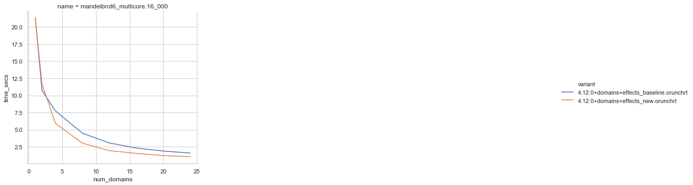

# Multicore OCaml: May 2021

Welcome to the May 2021 [Multicore
OCaml](https://github.com/ocaml-multicore/ocaml-multicore) monthly
report! Most of us have been under strict lockdown and continue to
deliver for the Multicore OCaml project in these challenging
times. This month's update along with the [previous
update's](https://discuss.ocaml.org/tag/multicore-monthly) have been
compiled by @avsm, @ctk21, @kayceesrk and @shakthimaan.

In the month of May 2021, there have been improvements both in the
ocaml-multicore repo itself and surrounding ecosystem. The multicore
compiler now supports CTF runtime traces of its garbage collector and
there are tools to display chrome tracing visualizations of the  garbage
collector events.  A number of performance improvements (see speedup
graphs in the following) that highlight some ways to make best use of
multicore were made to the existing benchmarks in Sandmark. A roadmap to
improve Tezos using Multicore OCaml has been proposed. The effects-based
IO style eio library for Multicore OCaml has made tremendous progress.
There has also been work on scaling up to 128 cores using task based
parallelism in domainslib using work stealing deques. We continue to
work on enhancing the tools for the ecosystem. The Safepoints PR for
upstream OCaml is now ready to be merged.

As always, we begin with the Multicore OCaml ongoing and completed
tasks. This is followed by the new proposed roadmap to improve Tezos
with Multicore OCaml. The ecosystem improvements are then listed
followed by the updates to the Sandmark benchmarking project. Finally,
the upstream OCaml work is mentioned for your reference.

## Multicore OCaml

### Ongoing

* [ocaml-multicore/ocaml-multicore#552](https://github.com/ocaml-multicore/ocaml-multicore/pull/552)
  Add a force_instrumented_runtime option to configure

  A new `--enable-force-instrumented-runtime` option is introduced to
  facilitate use of the instrumented runtime on linker invocations to
  obtain event logs.

* [ocaml-multicore/ocaml-multicore#553](https://github.com/ocaml-multicore/ocaml-multicore/issues/553)
  Testsuite failures with flambda enabled

  A list of tests are failing on `b23a416` with flambda enabled, and
  they need to be investigated further.

* [ocaml-multicore/ocaml-multicore#555](https://github.com/ocaml-multicore/ocaml-multicore/pull/555)
  runtime: CAML_TRACE_VERSION is now set to a Multicore specific value

  Define a `CAML_TRACE_VERSION` to distinguish between Multicore OCaml
  and trunk for the runtime.

* [ocaml-multicore/ocaml-multicore#558](https://github.com/ocaml-multicore/ocaml-multicore/pull/558)
  Refactor Domain.{spawn/join} to use no critical sections

  The PR removes the use of `Domain.wait` and critical sections in
  `Domain.{spawn/join}`.

* [ocaml-multicore/ocaml-multicore#559](https://github.com/ocaml-multicore/ocaml-multicore/pull/559)
  Improve the Multicore GC Stats

  A draft PR to include more Multicore GC statistics when using
  `OCAMLRUNPARAM=v=0x400`.

### Completed

* [ocaml-multicore/ocaml-multicore#508](https://github.com/ocaml-multicore/ocaml-multicore/pull/508)
  Domain Local Allocation Buffers

  The Domain Local Allocation Buffer implementation for OCaml Multicore has been dropped for now. A discussion is on the PR itself and there is a wiki
  page [here](https://github.com/ocaml-multicore/ocaml-multicore/wiki/Domain-Local-Allocation-Buffers-Addendum).

* [ocaml-multicore/ocaml-multicore#527](https://github.com/ocaml-multicore/ocaml-multicore/pull/527)
  Port eventlog to CTF

  The porting of the `eventlog` implementation to the Common Trace
  Format is now complete.

  For an introduction to producing Chrome trace visualizations of the
  runtime events see [eventlog-tools](https://github.com/ocaml-multicore/eventlog-tools/tree/multicore_wip). This postprocessing tool turns the CTF
  trace into the Chrome tracing format that allows interactive visualizations
  like this:

  

* [ocaml-multicore/ocaml-multicore#543](https://github.com/ocaml-multicore/ocaml-multicore/pull/543)
  Parallel version of weaklifetime test

  A parallel version of the `weaklifetime.ml` test is now added to the
  test suite.

* [ocaml-multicore/ocaml-multicore#546](https://github.com/ocaml-multicore/ocaml-multicore/pull/546)
  Coverage of domain life-cycle in domain_dls and ephetest_par tests

  Additional tests to increase test coverage for domain life-cycle for
  `domain_dls.ml` and `ephetest_par.ml`.

* [ocaml-multicore/ocaml-multicore$#550](https://github.com/ocaml-multicore/ocaml-multicore/pull/550)
  Lazy effects test

  Inclusion of a test to address effects with Lazy computations for a
  number of different use cases.

* [ocaml-multicore/ocaml-multicore#557](https://github.com/ocaml-multicore/ocaml-multicore/pull/557)
  Remove unused domain functions

  A clean-up to remove unused functions in `domain.c` and `domain.h`.

## Tezos

Multicore OCaml brings support for shared memory parallel programming
using domains and native concurrency support using effect
handlers. OCaml 5.0 will be domains only. This will be followed by
OCaml 5.1 with runtime support for effect handlers, followed by OCaml
5.2/OCaml 6.0(?) with support for an effect system.

The main goal for the Tezos development team is to increase
transactions per second (TPS) from 10X to 100X. Any opportunity to
increase TPS is of interest to the Tezos dev team.

A Tezos node has two main components: the shell and the protocol. The
shell is like the operating system that provides the services for
executing the smart contracts. The protocol core is the engine for
executing the smart contracts using the shell provided services.

### Opportunities for Multicore OCaml to improve Tezos

There is opportunity for parallelism in both the Tezos shell and
node. Exploting parallelism opportunities in the shell seems easier.

* Offloading compute-intensive tasks: One low hanging fruit is to
  offload the compute intensive computations in the shell such as
  crypto and serialisation to a different domain. Multicore team had
  prototyped a version of Lwt which offloads computations using the
  Lwt preemptive API. In order for this to be usable in Tezos, we need
  to work with the Lwt maintainers (Raphaël Proust and ??) to build
  and maintain Multicore version of Lwt that implements this
  offloading capability. Then, Tezos can take advantage of this
  building on OCaml 5.0. One of the first places to try this out in
  the shell would be for the parallel verification of signatures,
  which is a stateless check and therefore should be easy to offload.

* Parallelism in Storage: Tezos shell uses Irmin in its storage
  layer. The updates to the Tezos ledger is staged in Irmin as commits
  in different branches. Every two weeks, these changes are
  consolidated into a linear history. This step includes tasks that
  are reminiscent of garbage collection, and can be parallelised. More
  broadly, the underlying principle of Irmin emphasises immutability,
  and hence, there should exist several opportunities to parallelise
  parts of Irmin.

* Direct-style shell: There is interest in getting rid of Lwt from the
  Tezos codebase since callback-oriented programming is bad for
  composability and maintenance. The multicore team is currently
  building a direct-style parallel I/O stack using the best I/O
  mechanism on each platform. The Multicore team finds immense
  benefits in terms of performance and code maintainability. However,
  from the Tezos dev team side, this is likely to require lots of
  resourcing, and hence, not a high-priority right now.

* Parallel execution of transactions: There is potential parallelism
  to be exploited in the transaction execution model. In Tezos, smart
  contracts may be composed of multiple transactions. Each transaction
  receives an input and possibly some tokens, has an internal storage,
  and as output can express modifications to its internal storage and
  possibly transfer its tokens. During the execution, the transaction
  may invoke other transactions. Such invocations are maintained in a
  queue, and is executed one after the other. The transactions in the
  queue may be executed in parallel ensuring that executions remain
  deterministic. One way to achieve determinsm is through lightweight
  static analysis that identifies transactions that touch disjoint
  pieces of state. Such disjoint transactions may be executed in
  parallel.

### Roadmap

The Multicore OCaml team will continue to head towards completing the
outstanding features to get to the OCaml 5.0 patch set. Apart from
this, we have sketched immediate next steps for improving Tezos with
Multicore OCaml.

* [T1: Tezos 4.12] Multicore OCaml tracks 4.12.0, and earlier versions
  are not maintained. Tezos doesn’t yet build on 4.12.0. There is
  ongoing work (needs issue/PR link) to make it build with
  4.12.0. This is a necessary step before we can build Tezos node
  using the Multicore compiler. It would be great to prioritise this
  from the Tezos dev team side.

* [T2 : OPAM health check] Ensure Tezos related packages are
  represented in the opam health check. Multicore team will ensure
  that any multicore related breakages are fixed.

* [T3: OCurrent CI] Ensure Tezos node is added to the Multicore OCaml
  OCurrent CI pipeline. OCurrent CI can run custom builds and tests,
  and track github branches for ongoing feedback to the developer
  teams. Compare this to OPAM health check, which only builds released
  packages, and does best effort approach to run the OPAM tests
  included with the package. Multicore team will work towards adding
  Tezos node to Multicore OCaml OCurrent CI.

* [T4: Multicore Lwt] Work with the Lwt maintainers to build and
  maintain an Lwt version that supports computation offloading. Ensure
  that this is ready for OCaml 5.0 release.

* [T5: Computation offload] Work with the Tezos dev team to identify
  computation offloading capabilities in the Tezos shell. Multicore
  team will work with Tezos dev team to add computation offloading.

* [T6: Tezos benchmarking] Work with the Tezos dev team to setup a
  benchmarking suite to quantify improvements to the Tezos
  node. Possibly, integrate this into the Multicore OCaml/Irmin
  benchmarking work. The aim is to compare the performance of Tezos on
  OCaml 4.12.0 and Multicore OCaml 4.12.0. As a part of this effort,
  we will deploy a Multicore Tezos node that will participate in the
  mainnet.

* [T7: Benchmark Computation offload] Multicore team benchmarks and
  iterates over the computation offloading implementation.

* [T8: OCaml 5.0] Multicore OCaml team will produce a stack of PRs
  against OCaml 4.13 that brings shared-memory parallelism support to
  OCaml. This will be tagged as OCaml 5.0. Multicore team will work
  with OCaml devs to upstream OCaml 5.0. Additionally, OCaml dev team
  has agreed to provide long-term support for OCaml 4.XX version.

* [T9: Arm64 backend] OCaml 5.0 MVP only targets amd64 on Linux and
  macOS. It is understood that Arm64 is very important for Tezos since
  many bakers use the EC2 Arm64 machines to perform baking. Multicore
  team will implement the Arm64 backend. This involves ensuring that
  the Multicore OCaml memory model is correctly implemented in the
  compiler.

* [T10: Parallelism in Irmin] Work with the Tezos Storage (Irmin) team
  to identify the parallelism opportunities in storage and implement
  it. This will be implemented by the Multicore team with assistance
  from the Irmin team.

* [T11: Benchmark Irmin parallelism] Multicore team will benchmark the
  improvements brought with the help of parallelism in Irmin.

  

## Ecosystem

### Ongoing

* [ocaml-multicore/eventlog-tools#2](https://github.com/ocaml-multicore/eventlog-tools/pull/2)
  Add a pausetimes tool

  The `eventlog_pausetimes` tool takes a directory of eventlog files
  and computes the mean, max pause times, as well as the distribution
  up to the 99.9th percentiles. For example:

  ```
  ocaml-eventlog-pausetimes /home/engil/dev/ocaml-multicore/trace3/caml-426094-* name
  {
    "name": "name",
    "mean_latency": 718617,
    "max_latency": 33839379,
    "distr_latency": [191,250,707,16886,55829,105386,249272,552640,1325621,13312993,26227671]
  }
  ```

* [domainslib#29](https://github.com/ocaml-multicore/domainslib/pull/29)
  Task stealing with CL deques

  This ongoing work to use task-stealing Chase Lev deques for scheduling
  tasks across domains is looking very promising. Particularly for machines
  with 128 cores.

* [ocaml-multicore/retro-httpaf-bench#10](https://github.com/ocaml-multicore/retro-httpaf-bench/pull/10)
  Add Eio benchmark

  The addition of an Eio benchmark for retro-httpaf-bench. This is a
  work-in-progress.

* [ocaml-multicore/eio#26](https://github.com/ocaml-multicore/eio/pull/26)
  Grand Central Dispatch Backend

  An early draft PR that implements the Grand Central Dispatch (GCD)
  backend for Eio.

* [ocsigen/lwt#860](https://github.com/ocsigen/lwt/pull/860)
  Lwt_domain: An interfacet to Multicore parallelism

  An on-going effort to introduce `Lwt_domain` for performing
  computations to CPU cores using Multicore OCaml's Domains.

### Completed

#### retro-httpaf-bench

The `retro-httpaf-bench` repository contains scripts for running HTTP
server benchmarks.

* [ocaml-multicore/retro-httpaf-bench#6](https://github.com/ocaml-multicore/retro-httpaf-bench/pull/6)
  Move OCaml to 4.12

  The build scripts have been updated to use 4.12.0.

* [ocaml-multicore/retro-httpaf-bench#8](https://github.com/ocaml-multicore/retro-httpaf-bench/pull/8)
  Adds a Rust benchmark using hyper

  The inclusion of the Hyper benchmark limited to a single core to
  match the other existing benchmarks.

* [ocaml-multicore/retro-httpaf-bench#9](https://github.com/ocaml-multicore/retro-httpaf-bench/pull/9)
  Release builds for dune, stretch request volumes, rust fixes and remove mimalloc

  The Dockerfile, README, build_benchmarks.sh and run_benchmarks.sh
  files have been updated.

* [ocaml-multicore/retro-httpaf-bench#15](https://github.com/ocaml-multicore/retro-httpaf-bench/pull/5)
  Make benchmark more realistic

  The PR enhances the implementation to correctly simulate a
  hypothetical database request, and the effects code has been updated
  accordingly.

#### eio

The `eio` library provides an effects-based parallel IO stack for
Multicore OCaml.

* [ocaml-multicore/eio#18](https://github.com/ocaml-multicore/eio/pull/18)
  Add fibreslib library

  The `promise` library has been renamed to `fibreslib` to avoid
  naming conflict with the existing package in opam, and the API
  (waiters and effects) has been split into its own respective
  modules.

* [ocaml-multicore/eio#19](https://github.com/ocaml-multicore/eio/pull/19)
  Update to latest ocaml-uring

  The code and configuration files have been updated to use the latest
  `ocaml-uring`.

* [ocaml-multicore/eio#20](https://github.com/ocaml-multicore/eio/pull/20)
  Add Fibreslib.Semaphore

  Implemented the `Fibreslib.Semaphone` module that is useful for
  rate-limiting, and based on OCaml's `Semaphore.Counting`.

* [ocaml-multicore/eio#21](https://github.com/ocaml-multicore/eio/pull/21)
  Add high-level Eio API

  A new Eio library with interfaces for sources and sinks. The README
  documentation has been updated with motivation and usage.

* [ocaml-multicore/eio#22](https://github.com/ocaml-multicore/eio/pull/22)
  Add switches for structured concurrency

  Implementation of structured concurrency with documentation examples
  for tracing and testing with mocks.

* [ocaml-multicore/eio#23](https://github.com/ocaml-multicore/eio/pull/23)
  Rename repository to eio

  The Effects based parallel IO for OCaml repository has now been
  renamed from `eioio` to `eio`.

* [ocaml-multicore/eio#24](https://github.com/ocaml-multicore/eio/pull/24)
  Rename lib_eioio to lib_eunix

  The names have been updated to match the dune file.

* [ocaml-multicore/eio#25](https://github.com/ocaml-multicore/eio/pull/25)
  Detect deadlocks

  An exception is now raised to detect deadlocks if the scheduler
  finishes while the main thread continues to run.

* [ocaml-multicore/eio#27](https://github.com/ocaml-multicore/eio/pull/27)
  Convert expect tests to MDX

  The expected tests have been updated to use the MDX format, and this
  avoids the need for ppx libraries.

* [ocaml-multicore/eio#28](https://github.com/ocaml-multicore/eio/pull/28)
  Use splice to copy if possible

  The effect Splice has been implemented along with the update to
  ocaml-uring, and necessary documentation.

* [ocaml-multicore/eio#29](https://github.com/ocaml-multicore/eio/pull/29)
  Improve exception handling in switches

  Additional exception checks to handle when multiple threads fail,
  and for `Switch.check` and `Fibre.fork_ignore`.

* [ocaml-multicore/eio#30](https://github.com/ocaml-multicore/eio/pull/30)
  Add eio_main library to select backend automatically

  Use `eio_main` to select the appropriate backend (`eunix`, for
  example) based on the platform.

* [ocaml-multicore/eio#31](https://github.com/ocaml-multicore/eio/pull/31)
  Add Eio.Flow API

  Implemented a Flow module that allows combinations such as
  bidirectional flows and closable flows.

* [ocaml-multicore/eio#32](https://github.com/ocaml-multicore/eio/pull/32)
  Initial support for networks

  Eio provides a high-level API for networking, and the `Network`
  module has been added.

* [ocaml-multicore/eio#33](https://github.com/ocaml-multicore/eio/pull/33)
  Add some design rationale notes to the README

  The README has been updated with design notes, and reference to
  further reading on the principles of Object-capability model.

* [ocaml-multicore/eio#34](https://github.com/ocaml-multicore/eio/pull/34)
  Add shutdown, allow closing listening sockets, add cstruct_source

  Added cstruct_source, `shutdown` method along with source, sink and
  file descriptor types.

* [ocaml-multicore/eio#35](https://github.com/ocaml-multicore/eio/pull/35)
  Add Switch.on_release to auto-close FDs

  We can now attach resources such as file descriptors to switches,
  and these are freed when the the switch is finished.

#### Sundries

* [ocaml-multicore/domainslib#23](https://github.com/ocaml-multicore/domainslib/issues/23)
  Running tests: moving to `dune runtest` from manual commands in
  `run_test` target

  The `dune runtest` command is now used to execute the tests.

* [ocaml-multicore/domainslib#24](https://github.com/ocaml-multicore/domainslib/pull/24)
  Move to Mutex & Condition from Domain.Sync.{notify/wait}

  The channel implementation using `Mutex` and `Condition` is now
  complete. The performance results are shown in the following graph:

  

* [ocaml-multicore/multicore-opam#53](https://github.com/ocaml-multicore/multicore-opam/pull/53)
  Add base-domains and base-effects packages

  The `base-domains` and `base-effects` opam files have now been added
  to multicore-opam.

* [ocaml-multicore/multicore-opam#54](https://github.com/ocaml-multicore/multicore-opam/pull/54)
  Shift all multicore packages to unique versions and base-domains dependencies

  The naming convention is to now use `base-effects` and
  `base-domains` everywhere.

## Benchmarking

### Ongoing

* [ocaml-bench/sandmark#230](https://github.com/ocaml-bench/sandmark/pull/230)
  Build for 4.13.0+trunk with dune.2.8.1

  A work-in-progress to upgrade Sandmark to use dune.2.8.1 to build
  4.13.0+trunk and generate the benchmarks. You can test the same
  using:

  ```
  TAG='"macro_bench"' make run_config_filtered.json
  RUN_CONFIG_JSON=run_config_filtered.json make ocaml-versions/4.13.0+trunk.bench
  ```

### Completed

#### Sandmark

##### Performance

* [ocaml-bench/sandmark#221](https://github.com/ocaml-bench/sandmark/pull/221)
  Fix up decompress iterations of work

  The use of `parallel_for`, simplification of `data_to_compress` to
  use `String.init`, and fix to correctly count the amount of work
  configured and done produces the following speed improvements:

  
  

* [ocaml-bench/sandmark#223](https://github.com/ocaml-bench/sandmark/pull/223)
  A better floyd warshall

  An improvement to the Floyd Warshall implementation that fixes the
  random seed so that it is repeatable, and improves the pattern
  matching.

  
  
  

* [ocaml-bench/sandmark#224](https://github.com/ocaml-bench/sandmark/pull/224)
  Some improvements for matrix multiplication

  The `matrix_multiplication` and `matrix_multiplication_multicore`
  code have been updated for easier maintenance, and results are
  written only after summing the values.

  
  

* [ocaml-bench/sandmark#225](https://github.com/ocaml-bench/sandmark/pull/225)
  Better Multicore EA Benchmark

  The Evolutionary Algorithm now inserts a poll point into `fittest`
  to improve the benchmark results.

  
  

* [ocaml-bench/sandmark#226](https://github.com/ocaml-bench/sandmark/pull/226)
  Better scaling for mandelbrot6_multicore

  The `mandelbrot6_multicore` scales well now with the use of
  `parallel_for` as observed in the following graphs:

  
  
  

* [ocaml-bench/sandmark#227](https://github.com/ocaml-bench/sandmark/pull/227)
  Improve nbody_multicore benchmark with high core counts

  The `energy` function is now parallelised with `parallel_for_reduce`
  for larger core counts.

  
  

* [ocaml-bench/sandmark#229](https://github.com/ocaml-bench/sandmark/pull/229)
  Improve game_of_life benchmarks

  The hot functions are now inlined to improve the `game_of_life`
  benchmarks, and we avoid initialising the temporary matrix with
  random numbers.

  
  

##### Sundries

* [ocaml-bench/sandmark#215](https://github.com/ocaml-bench/sandmark/pull/215)
  Remove Gc.promote_to from treiber_stack.ml

  The 4.12+domains and 4.12+domains+effects branches have
  `Gc.promote_to` removed from the runtime.

* [ocaml-bench/sandmark#216](https://github.com/ocaml-bench/sandmark/pull/216)
   Add configs for 4.12.0+stock, 4.12.0+domains, 4.12.0+domains+effects

   The ocaml-version configuration files for 4.12.0+stock,
   4.12.0+domains, and 4.12.0+domains+effects have now been included
   to Sandmark.

* [ocaml-bench/sandmark#220](https://github.com/ocaml-bench/sandmark/pull/220)
  Attempt to improve the OCAMLRUNPARAM documentation

  The README has been updated with more documentation on the use of
  OCAMLRUNPARAM configuration when running the benchmarks.

* [ocaml-bench/sandmark#222](https://github.com/ocaml-bench/sandmark/pull/222)
  Deprecate 4.06.1 and 4.10.0 and upgrade to 4.12.0

  The 4.06.1, 4.10.0 ocaml-versions have been removed and the CI
  has been updated to use 4.12.0 as the default version.

#### current-bench

* [ocurrent/current-bench#103](https://github.com/ocurrent/current-bench/issues/103)
  Ability to set scale on UI to start at 0

  The graph origins now start from `[0, y_max+delta]` for the y-axis
  for better comparison.

  

* [ocurrent/current-bench#121](https://github.com/ocurrent/current-bench/pull/121)
  Use string representation for docker cpu setting.

  The `OCAML_BENCH_DOCKER_CPU` setting now switches from Integer to
  String to support a range of CPUs for parallel execution.

## OCaml

### Ongoing

* [ocaml/ocaml#10039](https://github.com/ocaml/ocaml/pull/10039)
  Safepoints

  The Sandmark benchmark runs to obtain the performance numbers for
  the Safepoints PR for 4.13.0+trunk have been published. The PR is
  ready to be merged.

## Job Advertisements

* [Multicore OCaml Runtime Systems Engineer](https://discuss.ocaml.org/t/runtime-systems-engineer-ocaml-labs-uk-tarides-fr-segfault-systems-in-remote/7959)
  OCaml Labs (UK), Tarides (France) and Segfault Systems (India)

* [Benchmark Tooling Engineer](https://tarides.com/jobs/benchmark-tooling-engineer)
  Tarides

Our thanks to all the OCaml users, developers and contributors in the
community for their continued support to the project. Stay safe!

## Acronyms

* AMD: Advanced Micro Devices
* API: Application Programming Interface
* CI: Continuous Integration
* CPU: Central Processing Unit
* CTF: Common Trace Format
* DLAB: Domain Local Allocation Buffer
* EA: Evolutionary Algorithm
* GC: Garbage Collector
* GCD: Grand Central Dispatch
* HTTP: Hypertext Transfer Protocol
* OPAM: OCaml Package Manager
* MVP: Minimal Viable Product
* PR: Pull Request
* TPS: Transactions Per Second
* UI: User Interface


