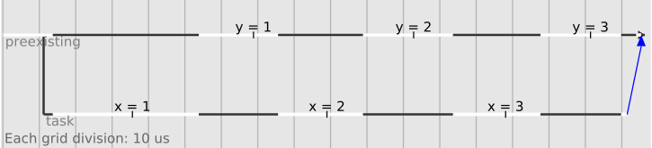

# Multicore OCaml: November 2021

Welcome to the November 2021 [Multicore
OCaml](https://github.com/ocaml-multicore/ocaml-multicore) monthly
report! This month's update along with the [previous
updates](https://discuss.ocaml.org/tag/multicore-monthly) have been
compiled by @avsm, @ctk21, @kayceesrk and @shakthimaan.

We continue our efforts on upstreaming Multicore OCaml, and the month
of November has seen the initiation on a lot of design
discussions. The ecosystem is continuing to evolve, and there is
significant updates to Eio, the Effects-based parallel IO for
OCaml. [Lwt.5.5.0](https://discuss.ocaml.org/t/ann-lwt-5-5-0-lwt-domain-0-1-0-lwt-react-1-1-5/8897)
has been released that supports the features of Multicore OCaml. The
Sandmark benchmarking has now been updated to build for 5.00, and the
current-bench tooling is being improved to better track the
performance analysis and upstream merge changes.

As always, the Multicore OCaml updates are listed first, which contain
the upstream efforts, documentation changes, and PR fixes. This is
followed by the ecosystem updates to `Eio` and `Tezos`. The Sandmark,
sandmark-nightly and current-bench tasks are finally listed for your
kind reference.

## Multicore OCaml

### Ongoing

#### Upstream

* [ocaml-multicore/ocaml-multicore#669](https://github.com/ocaml-multicore/ocaml-multicore/pull/669)
  Set thread names for domains
  
  A patch that implements thread naming for Multicore OCaml. It
  provides an interface to name Domains and Threads differently. The
  changes have now been rebased with check-typo fixes.

* [ocaml-multicore/ocaml-multicore#733](https://github.com/ocaml-multicore/ocaml-multicore/issues/733)
  Improve the virtual memory consumption on Linux
  
  An ongoing design discussion on orchestrating the minor heap
  allocations of domains for virtual memory performance, domain spawn
  and termination, performance and safety of `Is_young` runtime usage,
  and change of minor heap size using `Gc` set.

* [ocaml-multicore/ocaml-multicore#735](https://github.com/ocaml-multicore/ocaml-multicore/pull/735)
  Add `caml_young_alloc_start` and `caml_young_alloc_end` in `minor_gc.c`
  
  `caml_young_alloc_start` and `caml_young_alloc_end` are not present
  in Multicore OCaml, and they should be the same as `young_start` and
  `young_end`.

* [ocaml-multicore/ocaml-multicore#736](https://github.com/ocaml-multicore/ocaml-multicore/issues/736)
  Decompress testsuite fails 5.0 because of missing pthread link flag
  
  An undefined reference to `pthread_sigmask` has been observed when
  `-lpthread` is not linked when testing the decompress testsuite.

* [ocaml-multicore/ocaml-multicore#737](https://github.com/ocaml-multicore/ocaml-multicore/issues/737)
  Port the new ephemeron API to 5.00
  
  An API for immutable ephemerons has been
  [merged](https://github.com/ocaml/ocaml/pull/10737) in trunk, and
  the respective changes need to be ported to 5.00.

* [ocaml-multicore/ocaml-multicore#740](https://github.com/ocaml-multicore/ocaml-multicore/pull/740)
  Systhread lifecycle
  
  The PR addresses the systhreads lifecycle in Multicore and provides
  fixes in `caml_thread_domain_stop_hook`, `Thread.exit` and
  `caml_c_thread_unregister`.

* [ocaml-multicore/ocaml-multicore#742](https://github.com/ocaml-multicore/ocaml-multicore/issues/742)
  Minor tasks from asynchronous review
  
  A list of minor tasks from the asynchronous review for OCaml 5.00
  release. The major tasks will have their own GitHub issues.

* [ocaml-multicore/ocaml-multicore#745](https://github.com/ocaml-multicore/ocaml-multicore/pull/745)
  Systhreads WG3 comments
  
  The commit names should be self-descriptive, use of non-atomic
  variables is preferred, and we should raise OOM when there is a
  failure to allocate thread descriptors.

* [ocaml-multicore/ocaml-multicore#748](https://github.com/ocaml-multicore/ocaml-multicore/pull/748)
  WG3 move `gen_sizeclasses`
  
  The PR moves `runtime/gen_sizeclasses.ml` to
  `tools/gen_sizeclasses.ml` and fixes check-typo issues.

* [ocaml-multicore/ocaml-multicore#750](https://github.com/ocaml-multicore/ocaml-multicore/issues/750)
  Discussing the design of Lazy under Multicore
  
  A ongoing discussion on the design of Lazy for Multicore OCaml that
  addresses sequential Lazy, concurrency problems, duplicated
  computations, and memory safety.

* [ocaml-multicore/ocaml-multicore#753](https://github.com/ocaml-multicore/ocaml-multicore/issues/753)
  C API to pin domain to C thread?
  
  A question on how to design an API that would allow creating a
  domain "pinned" to an existing C thread, from C.

* [ocaml-multicore/ocaml-multicore#754](https://github.com/ocaml-multicore/ocaml-multicore/issues/754)
  Improvements to `emit.mlp` organization
  
  The `preproc_fun` function should be moved to a target-independent
  module, and all the prologue code needs to be emitted in one place.

* [ocaml-multicore/ocaml-multicore#756](https://github.com/ocaml-multicore/ocaml-multicore/pull/756)
  RFC: Generalize the `Domain.DLS` interface to split PRNG state for child domains
  
  The PR demonstrates an implementation for a "proper" PRNG+Domains
  semantics where spawning a domain "splits" the PRNG state.

* [ocaml-multicore/ocaml-multicore#757](https://github.com/ocaml-multicore/ocaml-multicore/issues/757)
  Audit `stdlib` for mutable state
  
  An issue tracker for the status of auditing `stdlib` for mutable
  state. OCaml 5.00 stdlib will have to guarantee both memory and
  thread safety.

#### Documentation

* [ocaml-multicore/ocaml-multicore#741](https://github.com/ocaml-multicore/ocaml-multicore/issues/741)
  Ensure copyright headers are formatted properly
  
  The copyright headers in the source files must be neatly formatted
  using the new format. If the old format already exists, then the
  author, institution details must be added as shown below:
  
  ```
  /**************************************************************************/
  /*                                                                        */
  /*                                 OCaml                                  */
  /*                                                                        */
  /*          Xavier Leroy and Damien Doligez, INRIA Rocquencourt           */
  /*          <author's name>, <author's institution>                       */
  /*                                                                        */
  /*   Copyright 1996 Institut National de Recherche en Informatique et     */
  /*     en Automatique.                                                    */
  /*   Copyright <first year written>, <author OR author's institution>     */
  /*   Included in OCaml under the terms of a Contributor License Agreement */
  /*   granted to Institut National de Recherche en Informatique et en      */
  /*   Automatique.                                                         */
  /*                                                                        */
  /*   All rights reserved.  This file is distributed under the terms of    */
  /*   the GNU Lesser General Public License version 2.1, with the          */
  /*   special exception on linking described in the file LICENSE.          */
  /*                                                                        */
  /**************************************************************************/
  ```

* [ocaml-multicore/ocaml-multicore#743](https://github.com/ocaml-multicore/ocaml-multicore/issues/743)
  Unhandled exceptions should render better error message
  
  A request to output informative `Unhandled_effect <EFFECT_NAME>`
  error message instead of `Unhandled` in the compiler output.

* [ocaml-multicore/ocaml-multicore#752](https://github.com/ocaml-multicore/ocaml-multicore/pull/752)
  Document the current Multicore testsuite situation
  
  A documentation update on how to run the Multicore OCaml
  testsuite. The steps are as follows:
  
  ```
  $ make world.opt
  $ cd testsuite
  $ make all-enabled
  ```

* [ocaml-multicore/ocaml-multicore#759](https://github.com/ocaml-multicore/ocaml-multicore/pull/759)
  Rename type variables for clarity
  
  The type variables in `stdlib/fiber.ml` have been updated for
  consistency and clarity.

#### Sundries

* [ocaml-multicore/ocaml-multicore#725](https://github.com/ocaml-multicore/ocaml-multicore/pull/725)
  Blocked signal infinite loop fix
  
  A monotonic `recorded_signals_counter` has been introduced to fix
  the possible loop in `caml_enter_blocking_section` when no domain
  can handle a blocked signal. A `signals_block.ml` callback test has
  also been added.

* [ocaml-multicore/ocaml-multicore#730](https://github.com/ocaml-multicore/ocaml-multicore/issues/730)
  `ocamlopt` raise a stack-overflow compiling `aws-ec2.1.2` and `color-brewery.0.2`
  
  A "Stack overflow" exception raised while compiling `aws-ec2.1.2`
  with 4.14.0+domains+dev0.

* [ocaml-multicore/ocaml-multicore#734](https://github.com/ocaml-multicore/ocaml-multicore/issues/734)
  Possible segfault when a new domain is signalled before it can initialize the domain_state
  
  A potential segmentation fault caused when a domain created by
  `Domain.spawn` receives a signal before it can reach its main
  entrypoint and initialize thread local data.

* [ocaml-multicore/ocaml-multicore#738](https://github.com/ocaml-multicore/ocaml-multicore/issues/738)
  Assertion violation when an external function and the GC run concurrently

  An `Assertion Violation` error message is thrown when Z3 tries to
  free GC cleaned up objects in the `get_unsat_core` function.

* [ocaml-multicore/ocaml-multicore#749](https://github.com/ocaml-multicore/ocaml-multicore/issues/749)
  Potential bug on `Forward_tag` short-circuiting?
  
  A bug when short-circuiting `Forward_tag` on values of type
  `Obj.forcing_tag`. Short-circuiting is disabled on values of type
  `Forward_tag`, `Lazy_tag` and `Double_tag` in the minor GC.

### Completed

#### Upstream

* [ocaml-multicore/ocaml-multicore#637](https://github.com/ocaml-multicore/ocaml-multicore/issues/637)
  `caml_page_table_lookup` is not available in ocaml-multicore

  Multicore does not have a page table, and `ancient` will not build
  if it references `caml_page_table_lookup`. The [Remove the remanents
  of page table
  functionality](https://github.com/ocaml-multicore/ocaml-multicore/pull/642)
  PR fixes this issue.
  
* [ocaml-multicore/ocaml-multicore#727](https://github.com/ocaml-multicore/ocaml-multicore/pull/727)
  Update version number
  
  The `ocaml-variants.opam` file has been updated to use
  `ocaml-variants.4.14.0+domains`.

* [ocaml-multicore/ocaml-multicore#728](https://github.com/ocaml-multicore/ocaml-multicore/issues/728)
  Update `base-domains` package for 5.00 branch
  
  The `base-domains` package now includes `4.14.0+domains`. Otherwise,
  the pinning on a local opam switch fails on dependency resolution.

* [ocaml-multicore/ocaml-multicore#729](https://github.com/ocaml-multicore/ocaml-multicore/pull/729)
  Introduce `caml_process_pending_signals` which raises if exceptional
  
  The code matches `caml_process_pending_actions` /
  `caml_process_pending_actions_exn` from trunk and cleans up
  `caml_raise_if_exception(caml_process_pending_signals_exn())` calls.

#### Documentation

* [ocaml-multicore/ocaml-multicore/744](https://github.com/ocaml-multicore/ocaml-multicore/pull/744)
  Make cosmetic change to comments in `lf_skiplist`
  
  The comments in `runtime/lf_skiplist.c` have been updated with
  reference to the paper by Willam Pugh on "Skip Lists".

* [ocaml-multicore/ocaml-multicore#746](https://github.com/ocaml-multicore/ocaml-multicore/pull/746)
  Frame descriptors WG3 comments

  The copyright headers have been added to
  `runtime/frame_descriptors.c` and `runtime/frame_descriptors.h`.

* [ocaml-multicore/ocaml-multicore#747](https://github.com/ocaml-multicore/ocaml-multicore/pull/747)
  Fix check typo for sync files

  The check-typo errors for `sync.c` and `sync.h` have been fixed.

* [ocaml-multicore/ocaml-multicore#755](https://github.com/ocaml-multicore/ocaml-multicore/pull/755)
  More fixes for check-typo

  The check-typo fixes for `otherlibs/unix/fork.c`,
  `runtime/finalise.c`, `runtime/gc_ctrl.c`, `runtime/Makefile` and
  `runtime/caml/eventlog.h` have been merged.
  
#### Sundries

* [ocaml-multicore/ocaml-multicore#720](https://github.com/ocaml-multicore/ocaml-multicore/pull/720)
  Improve ephemerons compatibility with testsuite
  
  The PR fixes `weaktest.ml` and also imports upstream changes to make
  ephemerons work with infix objects.

* [ocaml-multicore/ocaml-multicore#731](https://github.com/ocaml-multicore/ocaml-multicore/pull/731)
  AFL: Segfault and lock resetting (Fixes [#497](https://github.com/ocaml-multicore/ocaml-multicore/issues/497))

  A fix to get AFL-instrumentation working again on Multicore
  OCaml. The PR also changes `caml_init_domains` to use
  `caml_fatal_error` consistently.

## Ecosystem

### Ongoing

* [ocaml-multicore/tezos#8](https://github.com/ocaml-multicore/tezos/issues/8)
  ci.Dockerfile throws warning
  
  The `numerics` library which enforced `c99` has been removed from
  Tezos, and hence this warning should not occur.

* [ocaml-multicore/domainslib#55](https://github.com/ocaml-multicore/domainslib/issues/55)
  `setup_pool`: option to exclude the current/first domain?
  
  The use case to not include the main thread as part of the pool is a
  valid request. The use of `async_push` can help with the same:
  
  ```
  (* main thread *)
  let pool = setup_pool ~num_additional_domains () in
  let promise = async_push pool initial_task in
  (* the workers are now executing the [initial_task] and 
     its children. main thread is free to do its thing. *)
  ....
  (* when it is time to terminate, for cleanup, you may optionally do *)
  let res = await pool promise (* waits for the promise to resolve, if not already *)
  teardown_pool pool
  ```

* [ocaml-multicore/eio#91](https://github.com/ocaml-multicore/eio/issues/91)
  [Discussion] Object Capabilities / API
  
  An open discussion on using an open object as the first argument of
  every function, and to use full words and expressions instead
  `network`, `file_systems` etc.

### Completed

#### Eio

* [ocaml-multicore/eio#86](https://github.com/ocaml-multicore/eio/pull/86)
  Update README to mention `libuv` backend
  
  The README.md file has been updated to mention that the library
  provides a generic backend based on `libuv`, that works on most
  platforms, and has an optimised backend for Linux using `io-uring`.

* [ocaml-multicore/eio#89](https://github.com/ocaml-multicore/eio/pull/89)
  Marking `uring` as vendored breaks installation
  
  The use of `pin-depends` for `uring` to avoid any vendoring
  installation issues with OPAM.

* [ocaml-multicore/eio#90](https://github.com/ocaml-multicore/eio/pull/90)
  Implicit cancellation
  
  A `lib_eio/cancel.ml` has been added to `Eio` that has been split
  out of `Switch`. The awaiting promises use the cancellation context,
  and many operations no longer require a switch argument.

* [ocaml-multicore/eio#92](https://github.com/ocaml-multicore/eio/pull/92)
  Update trace diagram in README
  
  The trace diagram in the README file has been updated to show two
  counting threads as two horizontal lines, and white regions
  indicating when each thread is running.
  
  

* [ocaml-multicore/eio#93](https://github.com/ocaml-multicore/eio/pull/93)
  Add `Fibre.first`
  
  The `Fibre.first` returns the result of the first fibre to finish,
  cancelling the other one. A `tests/test_fibre.md` file has also been
  added with this PR.
  
* [ocaml-multicore/eio#94](https://github.com/ocaml-multicore/eio/pull/94)
  Add `Time.with_timeout`
  
  The module `Time` now includes both `with_timeout` and
  `with_timeout_extn` functions to `lib_eio/eio.ml`.
  
* [ocaml-multicore/eio#95](https://github.com/ocaml-multicore/eio/pull/95)
  Track whether cancellation came from parent context
  
  A `Cancelled` exception is raised if the parent context is asked to
  exit, so as to propagate the cancellation upwards. If the
  cancellation is inside, the original exception is raised.

* [ocaml-multicore/eio#96](https://github.com/ocaml-multicore/eio/pull/96)
  Add `Fibre.all`, `Fibre.pair`, `Fibre.any` and `Fibre.await_cancel`
  
  The `all`, `pair`, `any` and `await_cancel` functions have been
  added to the `Fibre` module in `libe_eio/eio.ml`.

* [ocaml-multicore/eio#97](https://github.com/ocaml-multicore/eio/pull/97)
  Fix MDX warning
  
  The `tests/test_fibre.md` file has been updated to fix MDX warnings.

* [ocaml-multicore/eio#98](https://github.com/ocaml-multicore/eio/pull/98)
  Keep an explicit tree of cancellation contexts
  
  A tree of cancellation contexts can now be dumped to the output, and
  this is useful for debugging.

* [ocaml-multicore/eio#99](https://github.com/ocaml-multicore/eio/pull/99)
  Make enqueue thread-safe
  
  Thread-safe promises, streams and semaphores have been added to
  Eio. The `make bench` target can test the same:
  
  ```
  dune exec -- ./bench/bench_promise.exe
  Reading a resolved promise: 4.684 ns
  use_domains,   n_iters, ns/iter, promoted/iter
        false,  1000000,   964.73,       26.0096
         true,   100000, 13833.80,       15.7142

  dune exec -- ./bench/bench_stream.exe
  use_domains,  n_iters, capacity, ns/iter, promoted/iter
        false, 10000000,        1,  150.95,        0.0090
        false, 10000000,       10,   76.55,        0.0041
        false, 10000000,      100,   52.67,        0.0112
        false, 10000000,     1000,   51.13,        0.0696
         true,  1000000,        1, 4256.24,        1.0048
         true,  1000000,       10,  993.72,        0.2526
         true,  1000000,      100,  280.33,        0.0094
         true,  1000000,     1000,  287.93,        0.0168

  dune exec -- ./bench/bench_semaphore.exe
  use_domains,  n_iters, ns/iter, promoted/iter
        false, 10000000,   43.36,        0.0001
         true, 10000000,  303.89,        0.0000
  ```

* [ocaml-multicore/eio#100](https://github.com/ocaml-multicore/eio/pull/100)
  Propogate backtraces in more places
  
  The `libe_eio/fibre.ml` and `lib_eio_linux/eio_linux.ml` have been
  updated to allow propagation of backtraces.

#### Tezos

* [ocaml-multicore/tezos#10](https://github.com/ocaml-multicore/tezos/pull/10)
  Fix `make build-deps`, fix NixOS support

  The patch fixes `make build-deps/build-dev-deps`, and `conf-perl`
  has been removed from the `tezos-opam-repository`.

* [ocaml-multicore/tezos#15](https://github.com/ocaml-multicore/tezos/pull/15)
  Fix `scripts/version.h`
  
  The CI build failure is now fixed with proper exporting of variables
  in `scripts/version.h` file.

* [ocaml-multicore/tezos#16](https://github.com/ocaml-multicore/tezos/pull/16)
  Fix `make build-deps` and `make build-dev-deps` to install correct OCaml switch
  
  The hardcoded OCaml switches have now been removed from the script
  file and the switch information from `script/version.h` is used with
  `make build-deps` and `make build-dev-deps` targets.

* [ocaml-multicore/tezos#17](https://github.com/ocaml-multicore/tezos/pull/17)
  Enable CI on pull request to `4.12.0+domains` branch
  
  CI has been enabled for pull requests for the 4.12.0+domains branch.

* [ocaml-multicore/tezos#20](https://github.com/ocaml-multicore/tezos/pull/20)
  Upstream updates
  
  A merge of the latest upstream build, code and documentation changes
  from Tezos repository.

#### Sundries

* [ocaml-multicore/tezos-opam-repository#6](https://github.com/ocaml-multicore/tezos-opam-repository/pull/6)
  Updates
  
  The dependency packages in the `tezos-opam-repository` have been
  updated, and `mtime.1.3.0` has been added as a dependency.

* [ocaml-multicore/ocaml-uring#40](https://github.com/ocaml-multicore/ocaml-uring/pull/40)
  Remove test dependencies on `Bos` and `Rresult`
  
  The `Bos` and `Rresult` dependencies have been removed from the
  project as we already depend on OCaml >= 4.12 which provides the
  required functions.

* [ocaml-multicore/ocaml-uring#42](https://github.com/ocaml-multicore/ocaml-uring/pull/42)
  Handle race in `test_cancel_late`
  
  A race condition from `test_cancel_late` in `tests/main.ml` has been
  fixed with this merged PR.

* [ocaml-multicore/domainslib#51](https://github.com/ocaml-multicore/domainslib/pull/51)
  Utilise effect handlers
  
  The tasks are now created using effect handlers, and a new
  `test_deadlock.ml` test has been added.

## Benchmarking

### Sandmark and Sandmark-nightly

#### Ongoing

* [ocaml-bench/sandmark-nightly#21](https://github.com/ocaml-bench/sandmark-nightly/issues/21)
  Add 5.00 variants
  
  Multicore OCaml now tracks OCaml trunk, and 4.12.0+domains+effects
  and 4.12+domains will only have bug fixes. The following variants
  are now required to be included in sandmark-nightly:

  * OCaml trunk, sequential, runtime (throughput)
  * OCaml 5.00, sequential, runtime
  * OCaml 5.00, parallel, runtime
  * OCaml trunk, sequential, pausetimes (latency)
  * OCaml 5.00, sequential, pausetimes
  * OCaml 5.00, parallel, pausetimes

* [ocaml-bench/sandmark#262](https://github.com/ocaml-bench/sandmark/issues/262)
  `ocaml-migrate-parsetree.2.2.0+stock` fails to compile with ocaml.5.00.0+trunk

  The `ocaml-migrate-parsetree` dependency does not work with OCaml
  5.00, and we need to wait for the 5.00 AST to be frozen in order to
  build the package with Sandmark.

* A `package_remove` feature is being added to the -main branch of
  Sandmark that allows to dynamically remove any dependency packages
  that are known to fail to build on recent development branches.

#### Completed

* [ocaml-bench/sandmark-nightly#22](https://github.com/ocaml-bench/sandmark-nightly/pull/22)
  Fix dataframe intersection order issue
  
  The `dataframe_intersection` function has been updated to properly
  filter out benchmarks that are not present for the variants that are
  being compared.

* [ocaml-bench/sandmark#248](https://github.com/ocaml-bench/sandmark/issues/248)
  Coq fails to build
  
  A new Coq tarball,
  [coq-multicore-2021-09-24](https://github.com/ejgallego/coq/releases/tag/multicore-2021-09-24),
  is now used to build with Sandmark for the various OCaml variants.
  
* [ocaml-bench/sandmark#257](https://github.com/ocaml-bench/sandmark/pull/257)
  Added latest Coq 2019-09 to Sandmark
  
  The Coq benchmarks in Sandmark now build fine for 4.14.0+domains and
  OCaml 5.00.
  
* [ocaml-bench/sandmark#260](https://github.com/ocaml-bench/sandmark/pull/260)
  Add 5.00 branch for sequential run. Fix notebook.

  Sandmark can now build the new 5.00 OCaml variant to build both
  sequential and parallel benchmarks in the CI.

* [ocaml-bench/sandmark#261](https://github.com/ocaml-bench/sandmark/pull/261)
  Update benchmark and domainslib to support OCaml 4.14.0+domains (OCaml 5.0)
  
  We now can build Sandmark benchmarks for OCaml 5.00, and the PR
  updates to use `domainslib.0.3.2`.

### current-bench

#### Ongoing

* [ocurrent/current-bench#219](https://github.com/ocurrent/current-bench/issues/219)
  Support overlay of graphs from different compiler variants

  At present, we are able to view the front-end graphs per OCaml
  version. We need to overlay graphs across compiler variants for
  better comparison and visualization.

* [ocurrent/current-bench#220](https://github.com/ocurrent/current-bench/issues/220)
  Setup current-bench and Sandmark for nightly runs
   
  On a tuned machine, we need to setup current-bench (backend and
  frontend) for Sandmark and schedule nightly runs.
  
* [ocurrent/current-bench#221](https://github.com/ocurrent/current-bench/issues/221)
  Support developer repository, branch and commits for Sandmark runs
   
  A request to run current-bench for developer branches on a nightly
  basis to visualize the performance benchmark results per commit.

#### Completed

* [ocurrent/curren-bench#106](https://github.com/ocurrent/current-bench/issues/106)
  Use `--privileged` with Docker run_args for Multicore OCaml
  
  The current-bench master (`3b3b31b...`) is able to run Multicore
  OCaml Sandmark benchmarks in Docker without requiring the
  `--privileged` option.

* [ocurrent/current-bench#146](https://github.com/ocurrent/current-bench/issues/146)
  Replicate `ocaml-bench-server` setup

  `current-bench` now supports the use of a custom `bench.Dockerfile`
  which allows you to override the TAG and OCaml variants to be used
  with Sandmark.

* [ocurrent/current-bench#190](https://github.com/ocurrent/current-bench/pull/190)
  Allow selected projects to run on more than one CPU
  
  A `OCAML_BENCH_MULTICORE_REPOSITORIES` environment variable has been
  added to build projects on more than one CPU core.

* [ocurrent/current-bench#195](https://github.com/ocurrent/current-bench/pull/195)
  Add instructions to start just frontend and DB containers
  
  The HACKING.md file has been updated with instructions to just start
  the frontend and database containers. This allows you to run
  benchmarks on any machine, and use an ETL script to dump the results
  to the database, and view them in the current-bench frontend.

We would like to thank all the OCaml users, developers and
contributors in the community for their continued support to the
project. Stay safe!

## Acronyms

* AFL: American Fuzzy Lop
* API: Application Programming Interface
* AST: Abstract Syntax Tree
* AWS: Amazon Web Services
* CI: Continuous Integration
* CPU: Central Processing Unit
* DB: Database
* DLS: Domain Local Storage
* ETL: Extract Transform Load
* GC: Garbage Collector
* IO: Input/Output
* MD: Markdown
* MLP: ML-File Preprocessed
* OOM: Out of Memory
* OPAM: OCaml Package Manager
* OS: Operating System
* PR: Pull Request
* PRNG Pseudo-Random Number Generator
* RFC: Request For Comments
* WG: Working Group
