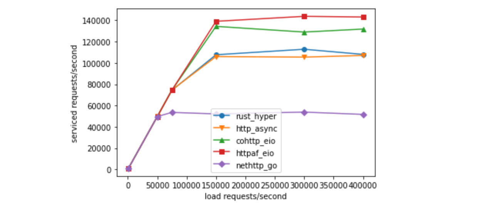

# Multicore OCaml: April 2022

Welcome to the April 2022 [Multicore
OCaml](https://github.com/ocaml-multicore/ocaml-multicore) monthly
report! The [previous
updates](https://discuss.ocaml.org/tag/multicore-monthly) have been
compiled by @avsm, @ctk21, @kayceesrk and @shakthimaan.

In the month of April 2022, we have been working on simplifying the
OCaml build process, and making improvements towards a stable 5.0
release. The `Effects` manual has been merged along with inclusion of
debugging tips in `runtime/HACKING.adoc`. The CI is actively reviewed
with the introduction of additional tests to the test suite. The
ecosystem has had updates to `eio`, `domainslib`, and `lockfree`. The
Sandmark benchmarking suite has new `nqueens`, `merge sort`, `quick
sort`, `hamming`, `soli`, `owl` and `ocaml plplot` benchmarks. The
current-bench project front-end has had changes to the user interface
and better display of metrics across graphs.

As always, the Multicore OCaml updates are listed first, which are
then followed by the ecosystem tooling updates. Finally, the sandmark
and current-bench project tasks are mentioned for your reference.

## Multicore OCaml

### Open

#### Asynchronous

* [ocaml/ocaml#11057](https://github.com/ocaml/ocaml/pull/11057)
  Implement quality treatment for asynchronous actions in multicore

  The Part 1/N of the PR has been merged. The Part 2/N is proposed for
  a review.

* [ocaml/ocaml#11095](https://github.com/ocaml/ocaml/pull/11095)
  Implement quality treatment for asynchronous actions in multicore (1/N)

  A series of commits for the [Implement quality treatment for
  asynchronous actions in
  Multicore](https://github.com/ocaml/ocaml/pull/11057)" PR.

* [ocaml/ocaml#11190](https://github.com/ocaml/ocaml/pull/11190)
  Implement quality treatment for asynchronous actions in multicore (2/N)

  The polling behaviour in C code has been restored by delaying
  finalisers until the next suitable safe point. The races where
  signals can be forgotten have also been removed.
  
#### Bug

* [ocaml/ocaml#11144](https://github.com/ocaml/ocaml/pull/11144)
  Restore frame-pointers support for AMD64

  The frame-pointers support for AMD64 architecture will be
  re-introduced in OCaml 5.0.0, and performance of this PR change is
  currently being analysed. A screenshot of the call-graph LBR (on
  i7-12700F) from OCaml to C is shown in the illustration.

  

* [ocaml/ocaml#11226](https://github.com/ocaml/ocaml/issues/11226)
  Segfault on MacOSX with trunk

  A segmentation fault that occurs in `caml_c_call` on Mac OS X with
  OCaml trunk.

#### Build

* [ocaml/ocaml#9413](https://github.com/ocaml/ocaml/issues/9413)
  ocamltest: escaping paths variables before handling them to run scripts in cygwin

  The `${program}` environment variable is not properly escaped when
  running the test suite under Cygwin for Windows.

* [ocaml/ocaml#10315](https://github.com/ocaml/ocaml/issues/10315)
  [Build] Support for composing the compiler in a dune build

  An open request to use the Dune build system to build the OCaml
  compiler. This will be useful for Multicore OCaml ecosystem
  development as well.

* [ocaml/ocaml#10940](https://github.com/ocaml/ocaml/issues/10940)
  `configure`: C11 atomic support required for 5.00.0

  A newer version of GCC can be used to build and test with C11 atomic
  support for OCaml 5.0.0 on RHEL 7 systems.

* [ocaml/ocaml#11149](https://github.com/ocaml/ocaml/pull/11149)
  Make the bootstrap process repeatable

  A ongoing discussion to enable the `make bootstrap` step to produce
  the exact same images in `boot/ocamlc` and `boot/ocamllex`,
  irrespective of the OS and architecture.

* [ocaml/ocaml#11182](https://github.com/ocaml/ocaml/issues/11182)
  Bootstrap problem when moving `Cont_tag` to be after `No_scan_tag`

  The `make boostrap` command fails at `$(MAKE) library-cross` when
  the `Cont_tag` is moved after `No_scan_tag`.

* [ocaml/ocaml#11203](https://github.com/ocaml/ocaml/pull/11203)
  Remove legacy Windows non-Unicode mode

  A request to disable the legacy non-Unicode mode for Windows.

#### Discussion

* [ocaml/ocaml#10960](https://github.com/ocaml/ocaml/issues/10960)
  Audit `stdlib` for mutable state
  
  The mutable state for the `Stdlib` modules is actively being
  reviewed in this issue tracker, as the OCaml 5.0.0 implementation
  should be both memory and thread-safe.

* [ocaml/ocaml#11013](https://github.com/ocaml/ocaml/issues/11013)
  Meta-issue for OCaml 5.0 release goals

  An issue tracker with a checklist for branching OCaml 5.0.0.

* [ocaml/ocaml#11074](https://github.com/ocaml/ocaml/issues/11074)
  OCaml 5.0 & unhandled exceptions

  An ongoing discussion on how best to handle unhandled exceptions in
  OCaml 5.0.0.

* [ocaml/ocaml#11138](https://github.com/ocaml/ocaml/pull/11138)
  Add C function `caml_thread_has_lock`

  An ongoing discussion and addition of the function
  `caml_thread_has_lock`, which returns true if the thread belongs to
  a domain, and also holds the lock for the same.

* [ocaml/ocaml#11176](https://github.com/ocaml/ocaml/issues/11176)
  Weird semantics for `exit` on multi-domain programs

  The `Domain.at_exit f` calls `Stdlib.at_exit f`, which in turn calls
  handlers of all domains. The semantics and recommended usage are
  actively being discussed.
  
#### Domain

* [ocaml/ocaml#11154](https://github.com/ocaml/ocaml/issues/11154)
  Add `Domain.get_name`

  A request to include `get_name` in the `Domain` module, since the
  API already contains a `set_name`.

* [ocaml/ocaml#11213](https://github.com/ocaml/ocaml/pull/11213)
  Refine `Domain.{at_exit,at_startup,at_first_spawn,at_each_spawn}` callback semantics

  `Domain.at_startup` has been renamed to
  `Domain.at_each_spawn`. `Domain.at_exit` is now
  domain-local. `Domain.at_first_spawn` and `Domain.at_each_spawn` run
  the callbacks in FIFO order.

#### Documentation

* [ocaml/ocaml#10992](https://github.com/ocaml/ocaml/issues/10992)
  OCaml multicore memory model and C (runtime, FFI, VM)

  A proposal document on the OCaml Multicore memory model and the use
  of the `Field` macro.

* [ocaml/ocaml#11164](https://github.com/ocaml/ocaml/issues/11164)
  Manual: give more hierarchical structure to the "Language extension" chapter

  As a follow-up to the inclusion of the `Effects` manual, it will be
  good to re-structure the chapter to have a more logical and less
  flat organization.

* [ocaml/ocaml#11171](https://github.com/ocaml/ocaml/pull/11171)
  Fix or document concurrency issues on channels in Multicore

  A few channel-related concurrency issues have been fixed, and
  thread-unsafety and IO functions have been documented.

#### Enhancement

* [ocaml/ocaml#11142](https://github.com/ocaml/ocaml/pull/11142)
  `Gc.set` now changes the minor heap size of all domains

  The reservation and allocation of minor heap up to the size of the
  per-domain reservation is the current design, and is suitable for
  memory loads that are not evenly distributed. This PR adjusts the
  semantics of `Gc.set` to set the minor heap size for all domains.

* [ocaml/ocaml#11156](https://github.com/ocaml/ocaml/issues/11156)
  Post-5.00 API for changing minor heap size

  A proposed list of suggestions for changing the minor heap size of
  all domains post-5.00 API.

* [ocaml/ocaml#11163](https://github.com/ocaml/ocaml/pull/11163)
  Always serialize doubles in little-endian

  The marshalling of OCaml's float is now made more
  platform-independent, at a slight cost for unmarshalling on
  big-endian systems.

* [ocaml/ocaml#11169](https://github.com/ocaml/ocaml/pull/11169)
  Avoid pushing untagged code pointers to the bytecode stack

  The bytecode interpreter is changed to ensure that code pointers are
  always tagged, avoiding any checks for the same. The change speeds
  up the `stacks` benchmark in Sandmark from ~50% slower than 4.13 to
  ~20% faster.

* [ocaml/ocaml#11174](https://github.com/ocaml/ocaml/pull/11174)
  Experimental id-based pthread names for domain, tick, backup threads

  The pthread names are now based on the program's pthread name when
  OCAMLRUNPARAM `T` is set. The process thread names are thus retained
  for debugging purposes.

* [ocaml/ocaml#11200](https://github.com/ocaml/ocaml/pull/11200)
  [3/3] Restructure LIBDIR: Move the Profiling module to a sub-directory

  The PR moves `profiling.*` from `$LIBDIR` to `$LIBDIR/profiling`,
  and hardens the use of `Profiling` within `ocamlprof`.

#### Refactor

* [ocaml/ocaml#11178](https://github.com/ocaml/ocaml/issues/11178)
  Reverse the execution order of functions registered via `Domain.{at_first_spawn, at_startup}`?

  The order imposed by `Domain.at_exit` and `Stdlib.at_exit` may not
  work for the current execution of functions registered with
  `Domain.{at_first_spawn, at_startup}`.

* [ocaml/ocaml#11198](https://github.com/ocaml/ocaml/pull/11198)
  [1/3] Restructure `LIBDIR`: Move Dynlink, Str and Unix to sub-directories

  The PR moves the Dynlink, Str and Unix libraries into
  sub-directories of `$LIBDIR`.

* [ocaml/ocaml#11221](https://github.com/ocaml/ocaml/issues/11221)
  Exception raising `Stdlib.at_exit` callback breaks `Stdlib.exit`

  `at_exit` callbacks should not throw exceptions. The suggestion is
  to trap such exceptions at the uncaught exception handler.

#### Safety

* [ocaml/ocaml#11193](https://github.com/ocaml/ocaml/pull/11193)
  Concurrency safety documentation, part one: concurrency unsafe types

  A warning is added on the concurrency safety in the documentation of
  the following modules: Buffer, Ephemeron, Oo, Hashtbl, Queue, Stack,
  Scanf, and Weak.

* [ocaml/ocaml#11209](https://github.com/ocaml/ocaml/pull/11209)
  Make `caml_domain_stop_hook` a public timing hook

  The PR makes `caml_domain_stop_hook` a public and thread-safe hook.

* [ocaml/ocaml#11227](https://github.com/ocaml/ocaml/pull/11227)
  stdlib concurrency safety documentation, part two: global states

  A new alert has been added in the standard library for the whole
  `Arg` module, the parameters of the GC, the status of the runtime
  warnings, for `Sys.interactive`.

* [ocaml/ocaml#11237](https://github.com/ocaml/ocaml/pull/11237)
  stdlib concurrency-safety documentation, part three: arrays

  A section of concurrency-safety has been added to the documentation
  for four mutable arrays in the standard library: arrays, byte
  sequences, bigarrays and Float.Array.t.

#### Sundries

* [ocaml/ocaml#10926](https://github.com/ocaml/ocaml/pull/10926)
  Ensure C global symbols are consistently prefixed

  The PR needs to be rebased and adapted to the recent removal of
  `otherlibs/win32unix`.

* [ocaml/ocaml#11091](https://github.com/ocaml/ocaml/pull/11091)
  Make sure a `MAP_STACK` signal stack gets unmapped

  The `MAP_STACK` is not cleared by `sigalstack`, and hence
  `mmap()/munmap()` the signal stack instead of `free()`.

* [ocaml/ocaml#11162](https://github.com/ocaml/ocaml/pull/11162)
  `instr_size` fixes for ARM64

  The PR adds some extra assembler directives to verify that the size
  of the assembled code is what the OCaml compiler thought it would
  be, and errors if the sizes are not correct.

* [ocaml/ocaml#11183](https://github.com/ocaml/ocaml/pull/11183)
  Refactor GitHub actions

  The current GitHub Actions workflow has been cleaned up, and the
  `full-lambda` and `other-checks` features and test scenarios have
  been re-introduced.

* [ocaml/ocaml#11191](https://github.com/ocaml/ocaml/issues/11191)
  `caml_shutdown` cleanup functions rework

  The cleanup functions in `caml_shutdown` need to be
  refactored. Their init functions are also different from
  `caml_startup_common`.

### Completed

#### Build

* [ocaml/ocaml#11180](https://github.com/ocaml/ocaml/pull/11180)
  Fix "inconsistent assumptions over interface Dynlink_compilerlibs" when working on the compiler

  A multi-target pattern rule has been added to
  `otherlibs/dynlink/Makefile` to produce both the `cmo` and `cmi`
  file for Dynlink_compilerlibs.

* [ocaml/ocaml#11228](https://github.com/ocaml/ocaml/pull/11228)
  stdlib audit: inheritable DLS for configurable options

  The configuration options for `Hashtbl` and `Filename` modules are
  made more explicit as domain-local states which are inherited by
  child domains.

* [ocaml/ocaml#11234](https://github.com/ocaml/ocaml/pull/11234)
  Build system: use C preprocessor flags more consistently

  The PR ensures that C files are compiled with `-DCAML_INTERNALS` and
  `-I$(ROOTDIR)/runtime` C preprocessor flags.

* [ocaml/ocaml#11240](https://github.com/ocaml/ocaml/pull/11240)
  Simplify `runtime/Makefile`
  
  The PR make changes to simplify `runtime/Makefile`. The `ASMFLAGS`
  and `EXTRALIBS` unused variable are removed. The `-DMODEL_xxx` flags
  are now passed for preprocessing assembly files and when compiliing
  C files for the native runtime.

#### Fix

* [ocaml/ocaml#10835](https://github.com/ocaml/ocaml/pull/10835)
  Relocation issues with clang on 32bit FreeBSD

  The `-Wl,-z,notext` options are passed to the linker on 32-bit Linux
  and BSD to fix the relocation issues with Clang.

* [ocaml/ocaml#11167](https://github.com/ocaml/ocaml/pull/11167)
  Fixed memory leak from signal stack.

  The memory leak from signal stack for handling signals on the first
  domain has been fixed.

* [ocaml/ocaml#11218](https://github.com/ocaml/ocaml/pull/11218)
  Fix source-code references in the backend files

  The error message locations in the various backend files have been
  fixed in this PR.

* [ocaml/ocaml#11230](https://github.com/ocaml/ocaml/pull/11230)
  ARM64: fix out-of-range immediate in add instruction

  The out-of-range immediate in the add instruction has been fixed.

* [ocaml/ocaml#11244](https://github.com/ocaml/ocaml/pull/11244)
  Hygiene fix in `weaklifetime_par.ml`

  The failing trunk CI has been fixed with a whitespace change.

#### Refactor

* [ocaml/ocaml#11158](https://github.com/ocaml/ocaml/pull/11158)
  Factor out reading `OCAMLTOP_INCLUDE_PATH` in `ocaml/ocamlnat`

  The code to parse `OCAMLTOP_INCLUDE_PATH` has been factored out to
  `toplevel/topcommon.ml`.

* [ocaml/ocaml#11160](https://github.com/ocaml/ocaml/pull/11160)
  otherlibs: Merge `win32unix` into `unix`

  The `unix` library is now built in `otherlibs/unix` directory
  irrespective of whether it is unix or win32 flavour.

* [ocaml/ocaml#11196](https://github.com/ocaml/ocaml/pull/11196)
  Simplify `Domain.join`

  The complicated logic in `Domain.join` has been simplified by using
  mutex and condition variables.

* [ocaml/ocaml#11199](https://github.com/ocaml/ocaml/pull/11199)
  [2/3] Restructure LIBDIR: Remove duplicate topdirs.cmi

  A second PR to separate the components in OCaml's `$LIBDIR`. It also
  changes the toplevel to adopt the debugger's approach and enriches
  the environment with `topdirs.ml` loaded from `+compiler-libs`.

* [ocaml/ocaml#11217](https://github.com/ocaml/ocaml/pull/11217)
  Limit bit-rot in the disabled backends

  The PR refactors the use of `Iload` in all the disabled backends,
  fixes the use of `Iextcall`, and adds `assert false` placeholders
  for `Idls_get`.

* [ocaml/ocaml#11219](https://github.com/ocaml/ocaml/pull/11219)
  Tidy-up the sigmask code in `domain.c`

  The `#ifdef` has been updated to check for `POSIX_SIGNALS` macro
  instead of `#ifndef _WIN32`.

* [ocaml/ocaml#11241](https://github.com/ocaml/ocaml/pull/11241)
  `ocamltest/run_win32.c`: include `caml/memory.h` rather than defining `CAML_INTERNALS`

  The use of `CAML_INTERNALS` has been removed from
  `ocamltest/run_win32.c`. Also, `caml/memory.h` has been included.

#### Enhancement

* [ocaml/ocaml#11159](https://github.com/ocaml/ocaml/pull/11159)
  Make `Domain.t` injective

  `Domain.t` has been made injective in its parameter, which is useful
  for defining effects that return a domain without using wrappers.

* [ocaml/ocaml#11189](https://github.com/ocaml/ocaml/pull/11189)
  Runtime: scan all native roots

  The PR scans all native global roots without relying on the global
  mutable state `caml_globals_inited`.

* [ocaml/ocaml#11214](https://github.com/ocaml/ocaml/pull/11214)
  Delay releasing joining domains

  The joining domains are now released only after the
  `domain_terminate` function in the runtime is completed.

* [ocaml/ocaml#11233](https://github.com/ocaml/ocaml/pull/11233)
  stdlib audit: make gc alarms atomic

  The inner state of GC alarms are made atomic in order to make it
  possible to delete alarms from any domains.
  
#### Testing

* [ocaml/ocaml#11165](https://github.com/ocaml/ocaml/pull/11165)
  Remove the useless injectivity test for `Stdlib.Domain`

  The injectivity test from `Stdlib.Domain` has been removed.

* [ocaml/ocaml#11197](https://github.com/ocaml/ocaml/pull/11197)
  Remove unnecessary linking on unix library in parallel tests

  The ocamltest stanzas from `tests/parallel` that do not use the Unix
  library have been removed.

* [ocaml/ocaml#11201](https://github.com/ocaml/ocaml/pull/11201)
  Make finaliser2 test deterministic

  The `weak-ephe-final/finaliser2` test has been made deterministic,
  and comments have been added to better describe the sub-tests.

#### Documentation

* [ocaml/ocaml#11058](https://github.com/ocaml/ocaml/pull/11058)
  `runtime/HACKING.adoc`: tips on debugging the runtime

  The `HACKING.adoc` document with information on the runtime system,
  and the `runtime/HACKING.adoc` file that explains troubleshooting
  has been merged.

* [ocaml/ocaml#11093](https://github.com/ocaml/ocaml/pull/11093)
  Effects manual

  An effect handlers tutorial has been merged to the OCaml manual.

* [ocaml/ocaml#11175](https://github.com/ocaml/ocaml/pull/11175)
  Revise the documentation of `Domain`

  The order of functions registered by `Domain.at_first_spawn`,
  `Domain.at_exit`, and `Domain.at_start` have been documented. Also,
  `@raise` has been documented in `Domain.join`.

* [ocaml/ocaml#11179](https://github.com/ocaml/ocaml/pull/11179)
  Explain the behavior and implementation of `Ident.tbl`

  The `typing/ident.ml` and `typing/ident.mli` files have now been
  updated to contain documentation on the implementation and
  functionality of `Ident.tbl`.

* [ocaml/ocaml#11181](https://github.com/ocaml/ocaml/pull/11181)
  Document that `Scanf` is not thread-safe

  A note has been added to `stdlib/scanf.mli` to indicate that
  `Scanf.Scanning_in_channel` should not be used concurrently.

* [ocaml/ocaml#11212](https://github.com/ocaml/ocaml/pull/11212) 
  Add missing `@since` annotation to `Gc.eventlog_resume` / Fix
  annotation @since to Effect to 5.0.0 rather than 5.00.0

  The `@since` annotation has been added to `Gc.eventlog_resume`.

#### Sundries

* [ocaml/ocaml#8878](https://github.com/ocaml/ocaml/pull/8878)
  Add `String.hash` and `String.seeded_hash`

  The PR adds a specialization of `caml_hash` for type `string` to the
  stdlib `String` module. For the following code example:
  
  ```
  let rec test fn test_str n_iter acc =
  match n_iter with
    | 0 -> acc
    | n ->
      let h = fn test_str in
      test fn test_str (n_iter-1) (acc+h)
  ```
  
  The micro-benchmarking results are as follows:
  
  ```
  string length    old (s)  new (s)  improvement (%)
            8      0.225    0.156             30.6
           16      0.252    0.194             22.9
           32      0.322    0.253             21.3
           64      0.461    0.393             14.8
          128      0.775     0.74             4.52
          256       1.45     1.36             6.02
          512        2.8     2.73             2.55
  ```

* [ocaml/ocaml#10809](https://github.com/ocaml/ocaml/pull/10809)
  Windows: replace `socket` with `WSASocket` and set `WSA_FLAG_NO_HANDLE_INHERIT`

  The `socket()` call is replaced with `WSASocket(domain, type,
  protocol, NULL, 0, WSA_FLAG_OVERLAPPED)`, which gives more needed
  control over the creation of sockets.

* [ocaml/ocaml#11220](https://github.com/ocaml/ocaml/pull/11220)
  Remove extraneous tabs from emitters

  The unnecessary tabs are converted to spaces, and `tools/cvt_emit`
  has been patched to warn about uses of tabs outside `"..."` and
  `...` blocks.

* [ocaml/ocaml#11236](https://github.com/ocaml/ocaml/pull/11236)
  Add missing `@since` annotation to `Gc.eventlog_pause`

  The `stdlib/gc.mli` has been updated with the missing `@since`
  annotation to `Gc.eventlog_pause`.

## Ecosystem

### retro-httpaf-bench

#### Open

* [ocaml-multicore/retro-httpaf-bench#24](https://github.com/ocaml-multicore/retro-httpaf-bench/pull/24)
  Replace shuttle with http-async

  The shuttle implementation is switched to using `http_async`
  instead. The benchmark runs for comparison under Docker for
  `RUN_DURATION=20` as shown below:
  
  

* [ocaml-multicore/retro-httpaf-bench#25](https://github.com/ocaml-multicore/retro-httpaf-bench/issues/25)
  Docker file fails to build: Unbound value `Input_channel.read_one_chunk_at_a_time`

  A build failure with an unbound value
  `Input_channel.read_one_chunk_at_a_time` when running `make` in the
  `retro-httpaf-bench` project.

### eio

#### Open

* [ocaml-multicore/eio#208](https://github.com/ocaml-multicore/eio/pull/208)
  Update the README to use OCaml 5.0

  A suggestion to update the README to use OCaml 5.0.

* [ocaml-multicore/eio#210](https://github.com/ocaml-multicore/eio/pull/210)
  Add condition variables and concurrent-mutexes

  A discussion on adding condition variables and concurrent mutexes to
  Eio. The suggestion is to use events (no payload) and variables.

* [ocaml-multicore/eio#211](https://github.com/ocaml-multicore/eio/issues/211)
  Check `EINTR` is handled correctly

  The system calls need to be retried if they return EINTR, unless
  they are being cancelled. The `eio_luv` backend also needs to be
  checked for handling the same.

* [ocaml-multicore/eio#213](https://github.com/ocaml-multicore/eio/pull/213)
  `Eio_linux`: handle sleeping tasks that are now due before paused fibers

  The scheduler prioritizes `paused fibers` before overdue `sleeping
  fibres`, and this PR attempts to address the issue.

* [ocaml-multicore/eio#214](https://github.com/ocaml-multicore/eio/issues/214)
  `Eio.Flow.read` hangs on closed flow

  The suggestion is to use `Eio.Flow.shutdown` and the server will
  read EOF, display the message from the client, and will close its
  own connection.

#### Completed

* [ocaml-multicore/eio#212](https://github.com/ocaml-multicore/eio/pull/212)
  Handle `EINTR` error when calling `getrandom` system call

  The `EINTR` error return code is handled when `getrandom` is called
  via `eio_linux` or `eio_luv` packages.

### domainslib

#### Open

* [ocaml-multicore/domainslib#68](https://github.com/ocaml-multicore/domainslib/issues/68)
  Scope of domainslib

  The lock-free queue implementation in domainslib has been cleaned
  up. This is a request to have `mpsc queues`, `concurrent hashmap`
  and more concurrency building blocks in domainslib.

#### Completed

* [ocaml-multicore/domainslib#69](https://github.com/ocaml-multicore/domainslib/pull/69)
  Make `Chan.t` and `Task.promise` injective

  The injectivity annotations with type constructors have been
  merged. This is especially useful for indexes of GADTs, in
  particular `Effect.t`.

* [ocaml-multicore/domainslib#70](https://github.com/ocaml-multicore/domainslib/pull/70)
  Remove `Ws_deque` module

  The `lockfree` dependency has been added to `Ws_deque`.

### effects-examples

#### Closed

* [ocaml-multicore/effects-examples#27](https://github.com/ocaml-multicore/effects-examples/pull/27)
  Add GitHub workflow for testing

  A `.github/workflows/ci.yml` has been added for CI testing.

* [ocaml-multicore/effects-examples#28](https://github.com/ocaml-multicore/effects-examples/pull/28)
  Fix typo

  A typo in the URL in the README has been fixed.

## lockfree

### Completed

* [ocaml-multicore/lockfree#7](https://github.com/ocaml-multicore/lockfree/issues/7)
  Setup travis CI build

  GitHub Actions workflow has been added to the project for CI runs.

* [ocaml-multicore/lockfree#11](https://github.com/ocaml-multicore/lockfree/pull/11)
  Upstream updates from @kit-ty-kate

  The `lockefree.opam` file has been updated to use `dune.3.0` along
  with the build step to include jobs.

## Benchmarking

### Sandmark

#### Open

##### Benchmarks

* [ocaml-bench/sandmark#299](https://github.com/ocaml-bench/sandmark/issues/299)
  Irmin 3 benchmarks

  A work-in-progress to update the Sandmark Irmin benchmark which
  replays the access patterns for Tezos.

* [ocaml-bench/sandmark#326](https://github.com/ocaml-bench/sandmark/issues/326)
  Port Comparison-Programming-Languages-Economics benchmark to OCaml

  A request to port the [Comparison of Programming Languages in
  Economics](https://github.com/mseri/Comparison-Programming-Languages-Economics)
  source code to OCaml and add them to Sandmark.

* [ocaml-bench/sandmark#331](https://github.com/ocaml-bench/sandmark/issues/331)
  Add OWL benchmarks

  A representative set of OWL benchmarks need to be included in
  Sandmark that are compute-intensive and that can be parallelized.

* [ocaml-bench/sandmark#336](https://github.com/ocaml-bench/sandmark/pull/336)
  Add Parallel benchmark mergesort

  An open PR to include a parallel benchmark of Merge Sort.

* [ocaml-bench/sandmark#341](https://github.com/ocaml-bench/sandmark/pull/341)
  Add OWL and OCaml plplot

  An early benchmark for OWL and OCaml plplot for Sandmark.

* [ocaml-bench/sandmark#342](https://github.com/ocaml-bench/sandmark/pull/342)
  Add Parallel benchmark Quick sort 

  A draft PR for a parallel implementation of Quick Sort.

##### Build

* [ocaml-bench/sandmark#313](https://github.com/ocaml-bench/sandmark/issues/313)
  Running serials tests yields Error: Program frama-c.byte not found in the tree or in PATH  (context: 5.0.0+stable_1)

  The `jo` tool is used in Sandmark, and the same needs to be
  installed when building and running the benchmarks.

* [ocaml-bench/sandmark#330](https://github.com/ocaml-bench/sandmark/issues/330)
  Duneify Sandmark

  A wishlist to use Dune to build Sandmark, instead of the Makefile.

* [ocaml-bench/sandmark#338](https://github.com/ocaml-bench/sandmark/issues/338)
  Running Sandmark with `run_all_serial.sh` on Fedora within the docker container produces compatibility issues with opam

  An opam build issue reported on Fedora running in Docker for the
  `run_all_serial.sh` script.

##### Documentation

* [ocaml-bench/sandmark#321](https://github.com/ocaml-bench/sandmark/issues/321)
  Write HACKING.md

  A request to write a comprehensive developer document for
  contributing to Sandmark.

* [ocaml-bench/sandmark#332](https://github.com/ocaml-bench/sandmark/issues/332)
  Add note about `--cpu-list` parameter in README

  A note on `--cpu-list` parameter can be documented to Sandmark.

##### Sundries

* [ocaml-bench/sandmark#309](https://github.com/ocaml-bench/sandmark/issues/309)
  Outreachy Applicants: Set-up and how-to

  A setup and how-to instructions for Outreachy participants to the
  Sandmark project.

* [ocaml-bench/sandmark#315](https://github.com/ocaml-bench/sandmark/pull/315)
  Rename Json Files

  A PR to rename the current `*run_config.json` files to be more
  meaningful for their intended purpose.

* [ocaml-bench/sandmark#327](https://github.com/ocaml-bench/sandmark/issues/327)
  Show diff output between expected and installed dependencies

  A difference list between the expected list of package dependencies
  and the installed packages need to be printed in the output.

#### Closed

##### Benchmarks

* [ocaml-bench/sandmark#322](https://github.com/ocaml-bench/sandmark/issues/322)
  Add nqueens benchmark

  The [PR#329 Add nqueents multicore to
  config](https://github.com/ocaml-bench/sandmark/pull/329) fixes the
  request to add the nqueens benchmark.

* [ocaml-bench/sandmark#323](https://github.com/ocaml-bench/sandmark/pull/323)
  Additional benchmarks `hamming` and `soli` to sandmark with their corresponding dune files.

  The `hamming.ml` and `soli.ml` benchmarks have been added to Sandmark.

* [ocaml-bench/sandmark#329](https://github.com/ocaml-bench/sandmark/pull/329)
  Add nqueens multicore to config

  The nqueens parallel benchmark has been added to Sandmark.

##### Build

* [ocaml-bench/sandmark#272](https://github.com/ocaml-bench/sandmark/issues/272)
  Delay benchmark runs if the machine is active

  A load average check for threshold 0.6 is checked prior to running
  the benchmarks.

* [ocaml-bench/sandmark#337](https://github.com/ocaml-bench/sandmark/pull/337)
  Remove `eventlog-tools`

  The `eventring` implementation will be used for tracing, and hence
  the older `eventlog-tools` in the Makefile has been removed.

* [ocaml-bench/sandmark#339](https://github.com/ocaml-bench/sandmark/pull/339)
  Fix nqueens failure

  A top-level run has been added to fix the nqueens failure for the
  parallel benchmark runs.

##### CI

* [ocaml-bench/sandmark#275](https://github.com/ocaml-bench/sandmark/issues/275)
  Move from drone CI to GitHub Actions

  The CI jobs from .drone.yml have been migrated to run with GitHub
  Actions workflow.

* [ocaml-bench/sandmark#312](https://github.com/ocaml-bench/sandmark/pull/312)
  Removed `failure:ignore`

  The `failure:ignore` option in `.drone.yml` file has been removed
  since 5.0.0+trunk is stable now.

* [ocaml-bench/sandmark#316](https://github.com/ocaml-bench/sandmark/pull/316)
  main.yml

  A new `.github/workflows/main.yml` GitHub Actions file has been
  added to run in the CI.

##### Sundries

* [ocaml-bench/sandmark#317](https://github.com/ocaml-bench/sandmark/pull/317)
  Add checks for `loadavg`

  A `loadavg` check has been added to ensure that the server is not
  busy before actually running the benchmarks.

* [ocaml-bench/sandmark#325](https://github.com/ocaml-bench/sandmark/pull/325)
  Fix typo on line 173 of README

  A spelling typo in the README has been fixed.

* [ocaml-bench/sandmark#328](https://github.com/ocaml-bench/sandmark/pull/328)
  Introduce a baseline variable and a check for baseline existence

  A new `baseline` variable is introduced in order to prompt the user
  for the baseline variant for the normalised graphs. The PR also
  checks for the existence of the variant.

  

### current-bench

#### Open

* [ocurrent/current-bench#355](https://github.com/ocurrent/current-bench/issues/355)
  Worker's name

  A request to identify two configurations running the same Docker
  image on the same server. A suggestion is to use a worker's name in
  `environments/production.conf`. For example:
  
  ```
  {
  "repositories": [
    {
      "name": "owner/repo",
      "name": "ocaml 4.14",
      "worker": "autumn", "image": "ocaml/opam:debian-11-ocaml-4.14",
    },
  ```

* [ocurrent/current-bench#356](https://github.com/ocurrent/current-bench/pull/356)
  Record commit messages and display them on hover on commit IDs

  A PR that fetches the commit messages from GitHub, and displays them
  when hovering on commit IDs.

* [ocurrent/current-bench#357](https://github.com/ocurrent/current-bench/pull/357)
  Install `*-bench.opam` in priority

  Thte `libirmin.opam` installation disables ARM64 and hence the same
  need to be skipped when running the Irmin benchmarks on the
  Raspberry Pi 4. The installation of `irmin-bench.opam` is sufficient.

#### Closed

##### Fix

* [ocurrent/current-bench#322](https://github.com/ocurrent/current-bench/issues/322)
  Adjust units on comparison commit values too

  The `AdjustMetrics.adjust` is now invoked for comparing benchmark
  values as well.

* [ocurrent/current-bench#348](https://github.com/ocurrent/current-bench/pull/348)
  Ensure comparison benchmark size metrics use correct units
 
  The PR ensures that the same units are used for each metric in the
  comparison benchmark data.
  
  Before
  
  
  After
  

* [ocurrent/current-bench#352](https://github.com/ocurrent/current-bench/pull/352)
  Fix GitHub status flag

  A minor fix to show the correct build status flag in GitHub.

* [ocurrent/current-bench#353](https://github.com/ocurrent/current-bench/pull/353)
  Use OCaml record instead of `Js.Obj` for Benchmark metadata

  A standard OCaml record for the metric data is now used instead of
  the `Js.Obj`.

##### Enhancement

* [ocurrent/current-bench#298](https://github.com/ocurrent/current-bench/issues/298)
  Production logs and warnings

  With the Slack integration, we now have a high level logs of actions
  performed by the pipeline.

* [ocurrent/current-bench#329](https://github.com/ocurrent/current-bench/issues/329)
  Use a standard record instead of a `Js.object` for metric data in `BenchmarkData.res`

  The refactoring of the metric data to use a standard record instead
  of a `Js.object` has been merged.

* [ocurrent/current-bench#333](https://github.com/ocurrent/current-bench/issues/333)
  Docker build arguments

  The use of `--build-args` for Docker in the OCluster pipeline is now
  supported, and is useful for Sandmark nightly runs. For example:
  
  ```
  {
  "repositories": [
    {
      "name": "local/local",
      "worker": "autumn",
      "build_args": ["FOO=42"]
    },
  ```

* [ocurrent/current-bench#345](https://github.com/ocurrent/current-bench/pull/345)
  Correctly handle carriage returns when counting line numbers

  A proper way to handle `\r`, `\r\n`, and `\n` in the browser when
  showing the line numbers in the UI.

* [ocurrent/current-bench#351](https://github.com/ocurrent/current-bench/pull/351)
  Opam install test dependencies

  The `(with-test)` libraries are also now installed in the default
  installation.

##### Frontend

* [ocurrent/current-bench#347](https://github.com/ocurrent/current-bench/pull/347)
  Frontend: Use same color for a sub-metric across different graphs

  We now use the same colour for each of the sub-metrics, in order to
  understand graphs for metrics like OCaml/OCaml.
  
  

* [ocurrent/current-bench#349](https://github.com/ocurrent/current-bench/pull/349)
  Hide closed PRs in the UI

  The old closed and merged PRs are visible in the sidebar, which was
  making it harder to view all the active benchmarks. This PR hides
  the closed PRs to help in easier naviagtion.

  

* [ocurrent/current-bench#350](https://github.com/ocurrent/current-bench/pull/350)
  Frontend: Fix crash when worker list is empty for a project

  A fix for the case when a worker list is empty is now handled in the
  frontend code.

Our special thanks to all the OCaml users, developers and contributors
in the community for their valuable time and continued support to the
project.

## Acronyms

* AMD: Advanced Micro Devices
* API: Application Programming Interface
* ARM: Advanced RISC Machines
* BSD: Berkeley Software Distribution
* CI: Continuous Integration
* DLS: Domain Local Storage
* EOF: End Of File
* FIFO: First In First Out
* LBR: Last Branch Record
* GADT: Generalized Algebraic Data Type
* GC: Garbage Collector
* GCC: GNU Compiler Collection
* FFI: Foreign Function Interface
* OPAM: OCaml Package Manager
* OS: Operating System
* PR: Pull Request
* UI: User Interface
* URL: Uniform Resource Locator
* VM: Virtual Machine
