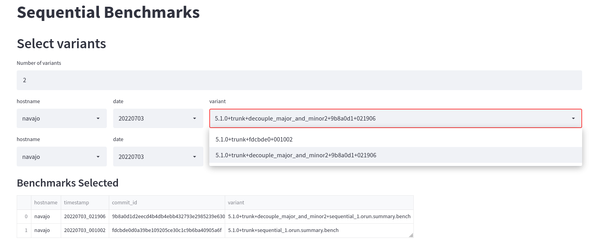
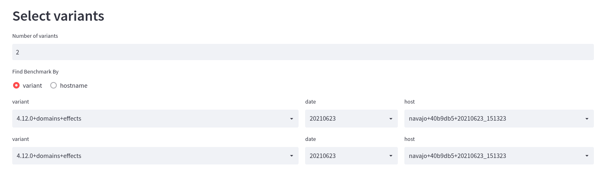

# Multicore OCaml: June 2022

Welcome to the June 2022 [Multicore
OCaml](https://github.com/ocaml-multicore/ocaml-multicore) monthly
report! The [previous
updates](https://discuss.ocaml.org/tag/multicore-monthly) along with
this report have been compiled by @avsm, @ctk21, @kayceesrk and
@shakthimaan.

In the month of June, we have actively worked on preparing for the
upcoming OCaml 5.0 release. The continuous integration for most OCaml
projects have been updated to build for `5.0.0~alpha0` and
`5.1.0+trunk`. The manuals and documentation are being updated to help
developers and users of OCaml. A lot of refactoring and removal of
dead code has been completed. In the ecosystem, the `Eio` module has
had multiple features added: `readdir` feature, `Mutex`, mock testing
libraries, `Buf_write` etc. The lockfree library has had multiple
requests for additional data structures for ease of use. The Sandmark
Nightly UI service now supports multiple workflows and has had
significant UI changes. There is a growing number of requests to
include energy measurements and metrics in Sandmark. The JSON parsing
has been enhanced in current-bench, and we continue to maintain its
benchmarking pipeline.

The Multicore OCaml updates are listed first, which are then followed
by the ecosystem tooling updates. Finally, the sandmark,
sandmark-nightly and current-bench project tasks are mentioned for
your reference.

## Multicore OCaml

### Open

#### Asynchronous

* [ocaml/ocaml#11057](https://github.com/ocaml/ocaml/pull/11057)
  Implement quality treatment for asynchronous actions in multicore

  The Part 3 out of N is currently proposed for review. Part 2 out of
  N has been merged.

* [ocaml/ocaml#11307](https://github.com/ocaml/ocaml/pull/11307)
  Implement quality treatment for asynchronous actions in multicore (3/3?)

  The enhancements for asynchronous actions for Multicore OCaml are
  actively being reviewed.

#### Build

* [ocaml/ocaml#11182](https://github.com/ocaml/ocaml/issues/11182)
  Bootstrap problem when moving `Cont_tag` to be after `No_scan_tag`

  The request for reallocation of tag numbers has been postponed, and
  the issue has been removed from the 5.0 milestone.

* [ocaml/ocaml#11268](https://github.com/ocaml/ocaml/pull/11268)
  Merge utils/Makefile into the root Makefile

  The PR to generate `ocamltest/ocamltest_config.ml` and
  `utils/config_fragment.ml` during the configure stage instead of the
  build process is actively being reviewed.

* [ocaml/ocaml#11282](https://github.com/ocaml/ocaml/pull/11282)
  Set `-g`, record backtraces by default

  A PR that makes `-g` flag enabled by default, and you can use
  `-no-g` to disable the generation of debugging information.

* [ocaml/ocaml#11292](https://github.com/ocaml/ocaml/issues/11292)
  On Ubuntu, configure fails with `flexlink does not work`

  A `flexlink does not work` error message observed with configure on
  OCaml 4.13+ for Ubuntu 21.04 and 22.04.

* [ocaml/ocaml#11343](https://github.com/ocaml/ocaml/pull/11343)
  Stop shipping the `configure` script

  A discussion on whether to have the `configure` script in the
  repository, as it will be generated as part of the release process.

#### Discussion

* [ocaml/ocaml#10960](https://github.com/ocaml/ocaml/issues/10960)
  Audit `stdlib` for mutable state

  The documentation needs to be integrated into the final release and
  a known issue needs to be fixed in `Buffer`.

* [ocaml/ocaml#11013](https://github.com/ocaml/ocaml/issues/11013)
  Meta-issue for OCaml 5.0 release goals

  The API documentation for `Effects`, `Domains`, and `Atomic` are
  ready. The possibility of linking to the manual and HTML
  post-processing possibilities need to be evaluated.

* [ocaml/ocaml#11080](https://github.com/ocaml/ocaml/pull/11080)
  Add a #reload directive

  Adding a new directive to the toplevel is slightly more effort than
  adding support to the toplevel for a new directive.
  
#### Documentation

* [ocaml/ocaml#10992](https://github.com/ocaml/ocaml/issues/10992)
  OCaml multicore memory model and C (runtime, FFI, VM)

  A proposal document on the OCaml Multicore memory model. In recent
  discussions, a dedicated use of `Load_field` that does an acquire
  load has been agreed. A simple and "expert" usage for the same is
  suggested with a cast to `volatile` for the implementation.

* [ocaml/ocaml#11280](https://github.com/ocaml/ocaml/pull/11280)
  Manual chapters on parallelism and memory model

  A manual chapter on parallelism features is under review.

* [ocaml/ocaml#11290](https://github.com/ocaml/ocaml/pull/11290)
  Add more information to `BOOTSTRAP.adoc`

  The documentation about the bootstrap process has been documented in
  BOOTSTRAP.adoc. The `make distclean` recommendation has been moved
  to the general bootstrap procedure.

* [ocaml/ocaml#11349](https://github.com/ocaml/ocaml/pull/11349)
  Runtime events docs

  The documentation for runtime events that includes a runtime tracing
  chapter, a section on `libruntime_events`, and updates to
  OCAMLRUNPARAM documents have been added.

#### Enhancement

* [ocaml/ocaml#9301](https://github.com/ocaml/ocaml/issues/9301)
  Monadic binding operators don't allow attributes

  An ongoing work to support attributes for each binding separately in
  a `let* ... and* ... and* ...` block.

* [ocaml/ocaml#10456](https://github.com/ocaml/ocaml/issues/10456)
  Ill-formed types during inclusion checking

  A suggestion to having signature items in recursive groups by
  explicitly annotating recursion in signatures.

* [ocaml/ocaml#11163](https://github.com/ocaml/ocaml/pull/11163)
  Always serialize doubles in little-endian

  This issue has been removed from the 5.0 milestone since the
  bootstraps are reproducible on little-endian machines only.

* [ocaml/ocaml#11174](https://github.com/ocaml/ocaml/pull/11174)
  Experimental id-based pthread names for domain, tick, backup threads

  An ongoing discussion to have naming of Backup and Tick threads by
  providing the same in an OPAM package.

* [ocaml/ocaml#11360](https://github.com/ocaml/ocaml/issues/11360)
  Increase the precision used for `string_of_float`

  A request to experiment with `%.17g` for `string_of_float`.

#### CI

* [ocaml/ocaml#10980](https://github.com/ocaml/ocaml/issues/10980)
  GitHub Actions / ocamltest / testsuite / OCaml 5

  An issue tracker for using GitHub Actions for OCaml 5. The latest
  request is to include test builds for ARM 32-bit.

* [ocaml/ocaml#11040](https://github.com/ocaml/ocaml/issues/11040)
  ThreadSanitizer issues

  The Thread Sanitizer has been removed from the Jenkins CI since
  OCaml 5 will not run for the same any time soon.

* [ocaml/ocaml#11294](https://github.com/ocaml/ocaml/pull/11294)
  Switch required autoconf to 2.71

  The autoconf version available in Ubuntu 22.4 is 2.69, and
  autconf-2.71 is not available on Ubuntu 20.4 or Fedora 35.

* [ocaml/ocaml#11346](https://github.com/ocaml/ocaml/pull/11346)
  CI check for committing files in .gitignore

  A check to ensure that the the `configure` script does not get
  accidently recommited to the repository.

* [ocaml/ocaml#11361](https://github.com/ocaml/ocaml/pull/11361)
  chore: Set permissions for GitHub actions

  A PR for the GitHub token permissions to be restricted to the
  required actions only.

#### Safety

* [ocaml/ocaml#11162](https://github.com/ocaml/ocaml/pull/11162)
  `instr_size` fixes for ARM64

  An extra assembler directive to verify the size of the assembled
  code for `instr_size` is under review.

* [ocaml/ocaml#11185](https://github.com/ocaml/ocaml/issues/11185)
  Embed the unhandled effect in the exception Unhandled

  A PR has been created that carries the effect when handling the
  exception for unhandled effects.

* [ocaml/ocaml#11279](https://github.com/ocaml/ocaml/issues/11279)
  Parallel access to Buffer can trigger segfaults

  A speed-up has been observed with the nospill benchmarks for
  `add_char`, but, the `add_string` benchmark is consistently slower.

#### Windows

* [ocaml/ocaml#9605](https://github.com/ocaml/ocaml/issues/9605)
  Compiling OCaml under the Windows Subsystem for Linux.

  An ongoing effort to compile OCaml 4.10.0 and OCaml 4.11 under
  Windows Subsystem for Linux, using MSVC64 2019 and mingw-64.

* [ocaml/ocaml#11328](https://github.com/ocaml/ocaml/issues/11328)
  Remaining domain safety issues on Windows file descriptors

  On Windows, `Unix.dup2 src dat` modifies either the file handle or
  socket handle of `dst` in an unsynchronized and non-atomic fashion.

* [ocaml/ocaml#11344](https://github.com/ocaml/ocaml/issues/11344)
  Pointer to a custom block manipulated as an `int`

  In the Windows implementation of `Unix`, the values declared as
  `int` are actually pointers to a `struct filedescr` and is
  fragile. The suggestion is to use the abstract type `file_descr` and
  the `handle` should be a `file_descr option`.

* [ocaml/ocaml#11348](https://github.com/ocaml/ocaml/pull/11348)
  `win32unix`: `find{first,next}`: use abstract type for directory handle

  The OCaml declarations should not use type `int` but a new abstract
  type `dir_descr` for the Windows implementation of `Unix`.
  
* [ocaml/ocaml#11350](https://github.com/ocaml/ocaml/issues/11350)
  Cygwin support in OCaml 5.0?
  
  The mingw-w64 is the only supported host on Windows for the OCaml
  5.0 release.

* [ocaml/ocaml#11367](https://github.com/ocaml/ocaml/pull/11367)
  Two Windows post-10831 clean-ups

  `caml_time_counter` has been updated to take advantage of the
  `frequency` computed in `caml_init_os_params`. The references to
  `DbgHelp` have been removed.

* [ocaml/ocaml#11374](https://github.com/ocaml/ocaml/pull/11374)
  Eliminate invalid pointer cast in `Unix.gettimeofday` along with some legacy code

  `unit64_t *` has stricter alignment requirements than `FILETIME *`
  and hence the pointer cast is illegal on Windows for
  `Unix.gettimeofday`. Hence, the pointer cast to the type has been
  removed.

#### Sundries

* [ocaml/ocaml#11137](https://github.com/ocaml/ocaml/pull/11137)
  Introduce `Store_tag_val(dst, val)` and use it in the runtime

  A discussion on making `caml_update_dummy` a synchronizing write,
  and to change `Tag_val(v)` as a non-lvalue.

* [ocaml/ocaml#11225](https://github.com/ocaml/ocaml/pull/11225)
  stdlib audit: use DLS for parsing global state

  The Parsing work state has been made a domain local state, and the
  performance impact of the change needs to be assessed.

* [ocaml/ocaml#11296](https://github.com/ocaml/ocaml/issues/11296)
  New syntax version

  A request to use `syntax v2` instead of the `-safe-syntax` option,
  but, the recommendation is to improve the tooling to check for
  correct syntax and indentation.

### Completed

#### Build

* [ocaml/ocaml#11299](https://github.com/ocaml/ocaml/pull/11299)
  Runtime_events fix for compilation on omnios/illumos

  The PR adds cast for compatibility with Illumnos' non-POSIX
  map/unmap functions.

* [ocaml/ocaml#11308](https://github.com/ocaml/ocaml/pull/11308)
  Add an environment variable to preserve runtime events after exit

  A `OCAML_RUNTIME_EVENTS_PRESERVE` environment variable has been
  added to preserve runtime_events after exit.

* [ocaml/ocaml#11310](https://github.com/ocaml/ocaml/pull/11310)
  Upgrade version in ocaml-variants.opam

  The `ocaml-variants.opam` file has been updated to use
  `5.1.0+trunk`, as otherwise building or installing with `opam pin`
  would fail.

* [ocaml/ocaml#11323](https://github.com/ocaml/ocaml/pull/11323)
  Delete `ocamlrun` before copying (for Mac M1)

  The Makefile has been updated to remove the `ocamlrun` executable
  before copying, which is especially useful on the Mac M1.

* [ocaml/ocaml#11352](https://github.com/ocaml/ocaml/pull/11352)
  Restore helpful error message when make is run before configure (#11347 revisited)

  The PR hides a dependency rule that was preventing error message
  from being displayed if the tree is not configured.

#### Bytecode

* [ocaml/ocaml#11065](https://github.com/ocaml/ocaml/pull/11065)
  Restore basic functionality to the bytecode debugger

  The test suite has passed and the basic functionality of the
  bytecode debugger has been completed and merged.

* [ocaml/ocaml#11337](https://github.com/ocaml/ocaml/pull/11337)
  Optimize bytecode root scanning

  In general, root scanning requires a code-fragment check, but, in
  the Sandmark stacks.ml benchmark case of `oldify_one`, we do not
  need a check.

#### CI

* [ocaml/ocaml#11183](https://github.com/ocaml/ocaml/pull/11183)
  Refactor GitHub actions

  The GitHub Actions workflow has been cleaned up, and the
  `full-lambda` and `other-checks` features and test scenarios have
  been re-introduced.

* [ocaml/ocaml#11311](https://github.com/ocaml/ocaml/pull/11311)
  Check Autoconf version in CI

  A check has been added to ensure that `configure` was generated with
  the required autoconf version.

* [ocaml/ocaml#11331](https://github.com/ocaml/ocaml/pull/11331)
  Limit GHA to pushes to maintenance branches

  The GitHub Actions are restricted for the maintenance branches to
  reduce the noise.

#### Cleanup

* [ocaml/ocaml#11342](https://github.com/ocaml/ocaml/issues/11342)
  "str.[i] <- c" is desugared into "String.set str i c" which does not exist anymore

  The function `String.set` does not exist any more, and hence the
  `(.[]<-)` operator has been removed.

* [ocaml/ocaml#11345](https://github.com/ocaml/ocaml/pull/11345)
  Remove (.[]<-)

  The operator `.[]<-` has been removed since `String.set` was already
  removed for the 5.0 release.

* [ocaml/ocaml#11369](https://github.com/ocaml/ocaml/pull/11369)
  Remove outdated Visual Studio compatibility code

  The PR drops support for Visual Studio 2005 and earlier, and is a
  pre-requisite for a non-critical bug fix.

#### Configure

* [ocaml/ocaml#10940](https://github.com/ocaml/ocaml/issues/10940)
  configure: C11 atomic support required for 5.00.0

  An ISO C 2011 compliant compiler, including full support for atomic
  types is now required to build the OCaml runtime system.

* [ocaml/ocaml#11295](https://github.com/ocaml/ocaml/pull/11295)
  configure: check support for C11 _Atomic types and operations

  The `aclocal.m4` file has been updated to check if the C compiler
  supports _Atomic types.

* [ocaml/ocaml#11370](https://github.com/ocaml/ocaml/issues/11370)
  4.14.0/4.14.1 - Long compiler options in CFLAGS breaks configure’s flexlink test

  The use of flexlink as a linker will be removed, and hence CFLAGS
  will not be used when testing flexlink.

#### Documentation

* [ocaml/ocaml#11333](https://github.com/ocaml/ocaml/pull/11333)
  Fix a small typo in effects manual

  A missing word has been added in the Effects manual.

* [ocaml/ocaml#11353](https://github.com/ocaml/ocaml/pull/11353)
  Better documentation for [`string_of_float`].

  The documentation for `string_of_float` has been updated in stdlib.

* [ocaml/ocaml#11355](https://github.com/ocaml/ocaml/pull/11355)
  READMEs: add note about 5.0 status

  The 4.14 version should be used if users want a stable OCaml
  release, and the README has been updated on the status of OCaml 5.0.

#### Domain

* [ocaml/ocaml#11154](https://github.com/ocaml/ocaml/issues/11154)
  Add `Domain.get_name` or remove `Domain.set_name` altogether

  The `Domain.set_name` primitive has been removed for 5.0.

* [ocaml/ocaml#11219](https://github.com/ocaml/ocaml/pull/11219)
  Tidy-up the sigmask code in domain.c

  The `#ifdef` construct for signal masking code is used to check for
  `POSIX_SIGNALS` macro instead of `#ifndef _WIN32`.

* [ocaml/ocaml#11264](https://github.com/ocaml/ocaml/pull/11264)
  Remove `Domain.set_name` primitive

  The runtime no longer assigns POSIX thread names and the
  `Domain.set_name` primitive has been removed for 5.0.

* [ocaml/ocaml#11309](https://github.com/ocaml/ocaml/pull/11309)
  Add a function to request a recommended max number of Domains

  A `Domain.recommended_domain_count` has been added to return the
  maximum number of parallel units of execution, as we are interested
  in the number of logical CPUs in the system.

#### Enhancement

* [ocaml/ocaml#10926](https://github.com/ocaml/ocaml/pull/10926)
  Ensure C global symbols are consistently prefixed

  The C functions in the Unix library are prefixed with `unix_`,
  except for the venerable `uerror`.

* [ocaml/ocaml#11007](https://github.com/ocaml/ocaml/pull/11007)
  Ship and install META files

  The `META` files are now always installed to subdirectories of
  OCaml's lib directory.

* [ocaml/ocaml#11138](https://github.com/ocaml/ocaml/pull/11138)
  Add C function `caml_thread_has_lock`

  An alternate implementation has been merged to make `Caml_state`
  NULL while the domain lock is not held. This PR is closed.

* [ocaml/ocaml#11176](https://github.com/ocaml/ocaml/issues/11176)
  Weird semantics for `exit` on multi-domain programs
  
  The refining of `Domain.{at_exit, at_startup, at_first_spawn,
  at_each_spawn}` callback semantics have fixed this issue.

* [ocaml/ocaml#11213](https://github.com/ocaml/ocaml/pull/11213)
  Refine `Domain.{at_exit,at_startup,at_first_spawn,at_each_spawn}` callback semantics

  `Domain.at_exit` is now domain-local, `Domain.at_startup` is renamed
  to `Domain.at_each_spawn`, and `Domain.at_first_spawn` is renamed to
  `Domain.before_first_spawn`.

* [ocaml/ocaml#11255](https://github.com/ocaml/ocaml/pull/11255)
  Make Field macro a volatile cast

  The PR makes the `Field` macro a volatile cast, and introduces the
  `Load_field` macro.

* [ocaml/ocaml#11271](https://github.com/ocaml/ocaml/pull/11271)
  Simplifications and fixes to multicore systhreads implementation

  The multicore systhreads implementation has been simplified along
  with a number of fixes, and removal of dead code.

* [ocaml/ocaml#11272](https://github.com/ocaml/ocaml/pull/11272)
  Make `Caml_state` `NULL` while the domain lock is not held

  The `Caml_state` is set to `NULL` inside of blocking sections and
  the change has been backported to 5.0 as well.

* [ocaml/ocaml#11273](https://github.com/ocaml/ocaml/pull/11273)
  Add a unique identifier for fibers

  A unique `int64_t` is added to `struct stack_info` to identify a
  fiber globally.

* [ocaml/ocaml#11284](https://github.com/ocaml/ocaml/pull/11284)
  Re-enabling mark stack pruning

  The mark stack pruning is now enabled when the mark stack reaches
  more than 1/32 of the major heap.

#### Fix

* [ocaml/ocaml#10868](https://github.com/ocaml/ocaml/pull/10868)
  Fix off-by-1 bug when initializing frame hashtables

  The PR fixes the off-by-1 bug when initializing frame hashtables.

* [ocaml/ocaml#11144](https://github.com/ocaml/ocaml/pull/11144)
  Restore frame-pointers support for AMD64

  The frame pointer support for AMD64 has been thoroughly reviewed and
  merged, including the addition of `testsuite/tests/frame-pointers`.

* [ocaml/ocaml#11302](https://github.com/ocaml/ocaml/issues/11302)
  ocamlc overwrites /dev/null

  A `Sys.is_regular_file` function has been introduced to use with
  ocamlc to avoid removing the target executable file, whenever it is
  not a regular file.

* [ocaml/ocaml#11303](https://github.com/ocaml/ocaml/pull/11303)
  Ensure that GC is not invoked from bounds check failures

  The C-specific preprocessing is skipped when raising a bounds check
  failure in `caml_array_bound_error`, in order to fix a bug on how
  array/string/bigarray bounds check failures can cause corruption or
  segfaults in programs that catch exceptions.

* [ocaml/ocaml#11319](https://github.com/ocaml/ocaml/issues/11319)
  Reflect "explicit binders for type variables" feature in `Types`?

  The `Types` represents semantic type, and `cd_vars` should not
  appear in `Types.constructor_declaration`.

* [ocaml/ocaml#11326](https://github.com/ocaml/ocaml/issues/11326)
  `caml_string_is_c_safe` and `caml_unix_check_path` aren't used correctly in OCaml 5

  The `caml_string_is_c_safe`, `caml_sys_check_path` and
  `caml_unix_check_path` functions need to be switched to copy their
  arguments, not for GC-safety, but, for parallel safety.

* [ocaml/ocaml#11356](https://github.com/ocaml/ocaml/pull/11356)
  Don't automatically unlock/lock I/O channels managed from C

  The I/O channels allocated from C are entirely managed by the C
  code, including locking and unlocking, so no automatic unlock/lock
  should take place in `check_pending`.

#### Testing

* [ocaml/ocaml#11121](https://github.com/ocaml/ocaml/issues/11121)
  `weaklifetime_par.ml` gets killed by OS's OOM-reaper on Raspberry Pi 4

  The `weaklifetime_par.ml` test was causing too many CI problems and
  the same has been disabled.

* [ocaml/ocaml#11305](https://github.com/ocaml/ocaml/pull/11305)
  Make runtime_events test more robust

  The runtime_events test has been changed from major slices to major
  cycles, where we are guaranteed three major cycles per
  `Gc.full_major`.

* [ocaml/ocaml#11364](https://github.com/ocaml/ocaml/pull/11364)
  Allow `make -C testuite promote` to take `TEST` and `LIST` variables

  The PR attempts to update the machinery for `promote` to be the same
  as for `one`. For example:
  
  ```
  make -C testsuite promote TEST=tests/typing-modules/printing.ml
  make -C testsuite promote LIST=file
  ```

#### Sundries

* [ocaml/ocaml#10964](https://github.com/ocaml/ocaml/pull/10964)
  Ring-buffer based runtime tracing (eventring)

  The Eventring runtime tracing system for continuous monitory of
  OCaml applications has been merged.

* [ocaml/ocaml#11190](https://github.com/ocaml/ocaml/pull/11190)
  Implement quality treatment for asynchronous actions in multicore (2/N)

  The polling behaviour in C code of OCaml 4 by delaying finalisers
  until the next suitable safe point has been merged, and the PR also
  removes races, whereby signals can be forgotten.

* [ocaml/ocaml#11253](https://github.com/ocaml/ocaml/pull/11253)
  Start the release of the `ocaml` command for other purposes

  The `ocaml script` and `ocamlnat` script have been deprecated, where
  `script` has no extension and is an implicit basename.

* [ocaml/ocaml#11298](https://github.com/ocaml/ocaml/pull/11298)
  Add `?auto_include` to `Toploop.set_paths`
  
  The PR provides the toplevel with an easier API for disabling the
  automatic inclusion mechanism to aid alternate toplevels.

* [ocaml/ocaml#11304](https://github.com/ocaml/ocaml/pull/11304)
  Fix data race on Windows file descriptors

  The data race on Windows file descriptions has been fixed, and a
  test case has been added to
  `testsuite/tests/lib-unix/win-channel-of`.

* [ocaml/ocaml#11351](https://github.com/ocaml/ocaml/issues/11351)
  API to know which platform my app running.

  `Sys.os_type` in OCaml returns the current operating system name.

## Ecosystem

### eio

#### Open

* [ocaml-multicore/eio#211](https://github.com/ocaml-multicore/eio/issues/211)
  Check `EINTR` is handled correctly

  The system calls need to be retried if they return `EINTR`. We do
  not always want to return `ECANCELED`.

* [ocaml-multicore/eio#221](https://github.com/ocaml-multicore/eio/pull/221)
  `eio_linux`: add support for integration with Async

  An open draft to run Async code from within Eio.

* [ocaml-multicore/eio#229](https://github.com/ocaml-multicore/eio/issues/229)
  Monotonic Support

  A request to support monotonic clock in `Stdenv.t` for Eio as in the
  system clock.

#### Completed

##### Addition

* [ocaml-multicore/eio#207](https://github.com/ocaml-multicore/eio/pull/207)
  Add `readdir` feature

  The PR provides a `readdir` feature for Eio, along with test cases
  in `tests/test_fs.md`.

* [ocaml-multicore/eio#210](https://github.com/ocaml-multicore/eio/pull/210)
  Add condition variables and concurrent-mutexes

  The PR has been rebased and merged with the inclusion of `Eio.Mutex`
  in `lib_eio/eio_mutex.ml`.

* [ocaml-multicore/eio#223](https://github.com/ocaml-multicore/eio/pull/223)
  Add `Eio.Mutex`
  
  A separate `Eio.Mutex` module has been used that make `waiters` a
  field, and also the API and documentation resemble
  `Stdlib.Mutex`. Benchmarks for Mutex have also been added.

* [ocaml-multicore/eio#225](https://github.com/ocaml-multicore/eio/pull/225)
  Add `Buf_read.{of_buffer, of_string, parse_string{,_exn}, return}`

  The inclusion of `Buf_read.of_buffer` that is slightly more
  efficient than reading from a flow, as it avoids allocating a fresh
  buffer and copying data.

* [ocaml-multicore/eio#227](https://github.com/ocaml-multicore/eio/pull/227)
  Add `<*>` combinator to `Buf_read`

  We already have `<*` and `*>`, and hence addinng a `<*>` combinator
  to `Buf_read`.

* [ocaml-multicore/eio#228](https://github.com/ocaml-multicore/eio/pull/228)
  Add `eio.mock` library for testing

  Mock flows and networks library have been added for testing.

* [ocaml-multicore/eio#235](https://github.com/ocaml-multicore/eio/pull/235)
  Add `Eio.Buf_write`

  A buffered writer has been merged where Bigstrings has been replaced
  with Cstructs in the API for consistency, and `operation` is now
  `await_batch`. `shift_buffers` and `shift_flushes` are now
  tail-recursive.

* [ocaml-multicore/eio#264](https://github.com/ocaml-multicore/eio/pull/264)
  Add `Eio.Dir.{unlink,rmdir}`

  The `lib_eio/dir.ml` file has been updated to include `unlink` and
  `rmdir` methods.

##### Documentation

* [ocaml-multicore/eio#220](https://github.com/ocaml-multicore/eio/pull/220)
  `Lwt_eio` has moved

  The README has been updated to point to the new `lwt_eio` GitHub
  repository.

* [ocaml-multicore/eio#231](https://github.com/ocaml-multicore/eio/pull/231)
  Minor updates for 5.0.0~alpha0

  A compiler warning is ignored and the README has been updated to use
  5.0.0~alpha0.

* [ocaml-multicore/eio#243](https://github.com/ocaml-multicore/eio/pull/243)
  Prepare release

  The CHANGES.md file have been updated to prepare for a new release.

##### Enhancement

* [ocaml-multicore/eio#222](https://github.com/ocaml-multicore/eio/pull/222)
  Check for cancellation when creating a non-protected child context

  We might end up with a cancelled parent context with a non-cancelled
  and non-protected child, and hence we need to check for
  cancellation.

* [ocaml-multicore/eio#226](https://github.com/ocaml-multicore/eio/pull/226)
  Fallback for `traceln` without an effect handler

  A `default_traceln` has been added to `lib_eio/eio.ml` to write
  output to stderr. The `traceln_mutex` prevents two domains writing
  to stderr at once.

* [ocaml-multicore/eio#239](https://github.com/ocaml-multicore/eio/pull/239)
  Allow short writes in `Read_source_buffer`
  
  The `Read_source_buffer` implementation now returns the number of
  bytes written, and `Linux_eio.Low_level.writev_single` exposes this
  behaviour directly.

* [ocaml-multicore/eio#242](https://github.com/ocaml-multicore/eio/pull/242)
  `Buf_write.of_buffer` needs a switch too

  The `lib_eio/buf_write.ml` file has been updated to create a new
  switch for `Buf_write.of_buffer`.

##### Fix

* [ocaml-multicore/eio#218](https://github.com/ocaml-multicore/eio/pull/218)
  `Eio_linux`: fix `read_dir`
  
  The `read_dir` was always reading from `env#cwd` and the same has
  been fixed.

* [ocaml-multicore/eio#237](https://github.com/ocaml-multicore/eio/pull/237)
  Move `Eio_null` to `Eio_mock.Backend`
  
  The inefficient list-based queue has been replaced with a proper
  `Lf_queue`, and tests can now be run as an event loop without
  depending on `eio_main`.

* [ocaml-multicore/eio#240](https://github.com/ocaml-multicore/eio/pull/240)
  Replace `accept_sub` with `accept_fork`

  The `fork_on_accept` has been removed as `accept_fork` handles the
  connection in a new fiber.

* [ocaml-multicore/eio#241](https://github.com/ocaml-multicore/eio/pull/241)
  Ensure `Buf_write` doesn't leak fibers

  The `Buf_write.create` method now takes a switch and aborts any
  waiting fibers when the switch finishes.

* [ocaml-multicore/eio#244](https://github.com/ocaml-multicore/eio/issues/244)
  close: file descriptor used after calling close!

  `accept_fork` closes the socket when the function returns, and this
  prevents the function from trying to close the socket itself. The
  `close` method from the socket type has been removed.

* [ocaml-multicore/eio#245](https://github.com/ocaml-multicore/eio/pull/245)
  Do not allow close on `accept_fork` socket
 
  The PR removes the `close` method from the socket type, since
  `accept_fork` was trying to close the socket when the function
  returned.

##### Performance

* [ocaml-multicore/eio#219](https://github.com/ocaml-multicore/eio/pull/219)
  `eio_linux`: make `read_dir` faster

  The performance of directory reads have been improved by using a
  large buffer and performing all reads in a single systhread as shown
  below:

  ```
  Read 152448 items in 1.188156s       Before
  Read 152448 items in 0.217013s       After
  ```

* [ocaml-multicore/eio#230](https://github.com/ocaml-multicore/eio/pull/230)
  Add `Buf_read` benchmark and optimise a bit

  A trivial `Buf_red` benchmark that parses individual characters in a
  tight loop has been added, and splits out the slow path of
  `Buf_read.ensure`. The corresponding read improvement is as follows:
  
  ```
  +Read 100000000 bytes in 0.558s     Before
  +Read 100000000 bytes in 0.402s     After
  ```

* [ocaml-multicore/eio#232](https://github.com/ocaml-multicore/eio/pull/232)
  Inline `Buf_read.consume`
  
  The `Buf_read.consume` use has been inlined and few misplaced and
  unnecessary attributes have been removed. The performance results
  are given below:
  
  ```
  +Read 100000000 bytes in 0.423s       Before
  +Read 100000000 bytes in 0.334s       After
  ```

##### Sundries

* [ocaml-multicore/eio#224](https://github.com/ocaml-multicore/eio/pull/224)
  Update to `5.0.0~alpha0`

  The compatibility with `4.12+domains` has been dropped, and the
  repository has been updated for `5.0.0~alpha0`.

* [ocaml-multicore/eio#234](https://github.com/ocaml-multicore/eio/pull/234)
  Move interfaces to individual files

  The concurrency primitives are independent of the OS abstractions,
  and `eio.mli` has been split into individual files.

* [ocaml-multicore/eio#236](https://github.com/ocaml-multicore/eio/pull/236)
  Remove some internal types from `Eio__core.mli`
  
  A few of the internal types were accidently exposed making them
  unusable, and hence they have been removed.

* [ocaml-multicore/eio#238](https://github.com/ocaml-multicore/eio/pull/238)
  `Eio_mock.Backend`: detect deadlock

  A test has been added to detect deadlocks as the mock backend only
  supports a single domain.

### domainslib

#### Open

* [ocaml-multicore/domainslib#14](https://github.com/ocaml-multicore/domainslib/issues/14)
  Interface to query CPU setup, numa information and set affinity

  An [ocaml-processor](https://github.com/haesbaert/ocaml-processor)
  library has been released to add an interface to query CPU setup,
  NUMA information and set affinity.

* [ocaml-multicore/domainslib#74](https://github.com/ocaml-multicore/domainslib/issues/74)
  Possible data races in `Task.parallel_scan`

  A race condition between initializing write in `Array.copy` and a
  read in `caml_modify`.

* [ocaml-multicore/domainslib#75](https://github.com/ocaml-multicore/domainslib/issues/75)
  Clarify usage patterns of `Task.run`

  The documentation needs to be updated for best practices in using
  `Task.run`.

#### Completed

* [ocaml-multicore/domainslib#73](https://github.com/ocaml-multicore/domainslib/pull/73)
  Add alpha repo to GitHub Actions

  The GitHub Actions have been updated to use the alpha repository.

* [ocaml-multicore/domainslib#76](https://github.com/ocaml-multicore/domainslib/pull/76)
  Run `5.0.0~alpha0` in the CI

  The GitHub Actions CI has been updated to build for `5.0.0~alpha0`
  and `5.1.0+trunk`.

### lockfree

#### Open

* [ocaml-multicore/lockfree#14](https://github.com/ocaml-multicore/lockfree/pull/14)
  Move lockfree tests from multicoretests repo here

  The `ws_deque` tests from multicoretests repository have been moved
  here. Also, the `test` directory has been split into
  sub-directories, where each data structure has its own test
  directory.

* [ocaml-multicore/lockfree#15](https://github.com/ocaml-multicore/lockfree/pull/15)
  Add single-producer single-consumer queue

  A request to add few lock-free structures (spsc queue, mpmc queue,
  multi-queue, spmc queue, spmc stack) to domainslib.
  
* [ocaml-multicore/lockfree#16](https://github.com/ocaml-multicore/lockfree/pull/16)
  Add multiple-producer single-consumer queue from eio repo
  
  A PR to add multiple producers, single consumer queue named
  `lf_queue` in Eio. It is renamed to `mpsc_queue` and also includes
  `qcheck` tests.

#### Completed

* [ocaml-multicore/lockfree#13](https://github.com/ocaml-multicore/lockfree/pull/13)
  Tests for `ws_deque` using QCheck

  The tests for the following different domain configuration have been
  added for the `ws_deque` data structure:

  * A producer alone
  * A producer and a single stealer
  * A producer and two stealers

* [ocaml-multicore/lockfree#17](https://github.com/ocaml-multicore/lockfree/pull/17)
  Run `5.0.0~alpha0` and `5.0.0+trunk` builds in the CI

  The GitHub Actions CI have been updated to build both `5.0.0~alpha0`
  and `5.0.0+trunk` variants.

* [ocaml-multicore/lockfree#18](https://github.com/ocaml-multicore/lockfree/issues/18)
  v0.1.3 hash table removed in v0.2.0?

  A newer hash table implementation to be compliant with the Multicore
  OCaml memory model is planned.

## Benchmarking

### Sandmark

#### Open

##### Benchmarks

* [ocaml-bench/sandmark#343](https://github.com/ocaml-bench/sandmark/pull/343)
  Irmin replay benchmark

  The dependencies have been installed successfully for the Irmin
  replay benchmark for 5.0.0~alpha0. The benchmark is throwing a fatal
  error that needs to be debugged.

* [ocaml-bench/sandmark#356](https://github.com/ocaml-bench/sandmark/issues/356)
  Update mergesort with a faster implementation

  A simpler version of mergesort is available that can replace the
  existing mergesort implementation in Sandmark.

* [ocaml-bench/sandmark#382](https://github.com/ocaml-bench/sandmark/issues/382)
  Integrate SPECpower benchmarks and measurements in Sandmark

  Explore the integration of [SPECpower
  benchmarks](https://www.spec.org/power/) in Sandmark.

##### Metrics

* [ocaml-bench/sandmark#361](https://github.com/ocaml-bench/sandmark/issues/361)
  Produce `memtrace` traces from benchmark runs

  The program's memory use is reported by memtrace, and its
  corresponding output should be displayed for Sandmark benchmarks.

* [ocaml-bench/sandmark#362](https://github.com/ocaml-bench/sandmark/issues/362)
  `olly latency` output with Sandmark

  The GC tail latency profile for OCaml executables are now reported
  using `olly latency`. The same needs to be integrated with Sandmark.

* [ocaml-bench/sandmark#378](https://github.com/ocaml-bench/sandmark/issues/378)
  Add `perf` energy metrics to Sandmark bench results

  The `perf` command should be used when running the benchmarks to
  provide the Joules `power/energy-pkg/` results.

* [ocaml-bench/sandmark#379](https://github.com/ocaml-bench/sandmark/issues/379)
  Measure energy power consumption through IPMI sensors

  The use of [ipmitool](https://github.com/ipmitool/ipmitool) to
  measure the energy power consumption should be reported in the
  benchmark results.

* [ocaml-bench/sandmark#380](https://github.com/ocaml-bench/sandmark/issues/380)
  Integrate `Variorum` for power and performance monitoring capabilities with Sandmark

  The [Variorum](https://github.com/LLNL/variorum) platform-agnostic
  library that exposes monitor and control interfaces for hardware
  architectures needs to be integrated with Sandmark.

* [ocaml-bench/sandmark#381](https://github.com/ocaml-bench/sandmark/issues/381)
  Report hardware resources in parallel architectures using `hwloc`

  The [hwloc](https://github.com/open-mpi/hwloc) and
  [ocaml-hwloc](https://github.com/patricoferris/ocaml-hwloc) packages
  need to be used in Sandmark to report information on the hardware
  for parallel architectures.

##### Dependencies

* [ocaml-bench/sandmark#341](https://github.com/ocaml-bench/sandmark/pull/341)
  Add owl 

* [ocaml-bench/sandmark#352](https://github.com/ocaml-bench/sandmark/pull/352)
  Add `js_of_ocaml` alpha

  A newer version of `js_of_ocaml` that builds with 5.1.0+trunk is
  required.

* [ocaml-bench/sandmark#357](https://github.com/ocaml-bench/sandmark/issues/357)
  Implement the solution for the Ubuntu/OpenBLAS problem in the GH Actions workflow

  The OpenBLAS library can be built locally in Ubuntu without
  requiring the use of `/opt`.

##### Sundries

* [ocaml-bench/sandmark#315](https://github.com/ocaml-bench/sandmark/pull/315)
  Rename Json Files

  Sandmark has been updated to build for 5.1.0+trunk, and few
  conflicting files in the PR must be resolved.

* [ocaml-bench/sandmark#358](https://github.com/ocaml-bench/sandmark/issues/358)
  Revive instrumented pausetimes using eventring

  The OCaml 5 eventring implementation is to be used to generate the
  pausetimes measurement in Sandmark.

* [ocaml-bench/sandmark#364](https://github.com/ocaml-bench/sandmark/issues/364)
  Add support for release-based tags in `run_config.json`

  In addition to benchmark tags based on execution time, it will be
  useful to select benchmarks based on OCaml releases.

#### Completed

##### Benchmarks

* [ocaml-bench/sandmark#359](https://github.com/ocaml-bench/sandmark/issues/359)
  `benchmarks/yojson/ydump.ml` fails with Unknown module Stream for 5.1.0

  The `yojson` benchmark has been updated to replace `Stream` with
  `Seq` to build with the OCaml 5.1.0+trunk.

* [ocaml-bench/sandmark#360](https://github.com/ocaml-bench/sandmark/pull/360)
  Yojson benchmark: Stream to Seq

  The changes to the Yojson benchmark from `Stream` to `Seq` module
  have been completed to build for 5.1.0.

##### Jupyter Notebooks

* [ocaml-bench/sandmark#259](https://github.com/ocaml-bench/sandmark/issues/259)
  Update Sandmark notebooks with latest changes from sandmark-nightly

  The Sandmark notebooks have been backported with the latest UI
  changes from the sandmark-nightly service.

* [ocaml-bench/sandmark#350](https://github.com/ocaml-bench/sandmark/issues/350)
  `Length of values does not match length of index` error in sequential Jupyter notebook

  The normalise error when there are different number of benchmarks in
  the baseline has been fixed.

* [ocaml-bench/sandmark#351](https://github.com/ocaml-bench/sandmark/pull/351)
  Fix normalise error when different number of benchmarks in baseline

  The error that occurs when displaying plots for the sequential
  benchmarks for a list of benchmarks that differ in the baseline has
  been fixed.

##### CI

* [ocaml-bench/sandmark#345](https://github.com/ocaml-bench/sandmark/issues/345)
  Remove `.drone.yml`

  We have moved to using the GitHub Actions CI, and hence `.drone.yml`
  file has been removed.

* [ocaml-bench/sandmark#354](https://github.com/ocaml-bench/sandmark/pull/354)
  Removed drone CI. See #345

  The `.drone.yml` file has been removed from the repository.

##### Dependencies

* [ocaml-bench/sandmark#346](https://github.com/ocaml-bench/sandmark/issues/346)
  Dependencies should include `jo`

  The Makefile has been updated to include `jo` as a dependency.

* [ocaml-bench/sandmark#355](https://github.com/ocaml-bench/sandmark/pull/355)
  Added jo as dependency. See #346

  The `jo` package has been added as dependency to Sandmark.

##### Sundries

* [ocaml-bench/sandmark#266](https://github.com/ocaml-bench/sandmark/issues/266)
  Instrumented pausetimes for ocaml - 5.00.0+trunk and 4.14.0+domains

  The instrumented pausetimes have to be redone using eventring.

* [ocaml-bench/sandmark#353](https://github.com/ocaml-bench/sandmark/pull/353)
  Use -alpha dune.2.9.3 to build with May 30, 2022 trunk

  The `ocamlfind.1.9.3.git` from the -alpha repository is now used
  along with `dune.2.9.3` to build the latest trunk.

### sandmark-nightly

#### Open

* [ocaml-bench/sandmark-nightly#66](https://github.com/ocaml-bench/sandmark-nightly/issues/66)
  Add webpage with perfstat output from Sandmark

  The [perfstat
  notebook](https://github.com/ocaml-bench/sandmark/pull/372) has been
  added to Sandmark, and the same results need to run and displayed as
  a separate page in Sandmark Nightly.

#### Completed

##### Automation

* [ocaml-bench/sandmark-nightly#42](https://github.com/ocaml-bench/sandmark-nightly/issues/42)
  Alert notification for Sandmark nightly runs

  A short summary of the nightly results is now sent as an alert on
  Slack with links to the execution logs.

* [ocaml-bench/sandmark-nightly#65](https://github.com/ocaml-bench/sandmark-nightly/issues/65)
  Automate merging testing to main branch for successful builds

  A GitHub Actions workflow has been provided to automatically merge
  successful bench results to the `main` branch.

* [ocaml-bench/sandmark-nightly#69](https://github.com/ocaml-bench/sandmark-nightly/pull/69)
  Automatically copy results for successful builds and notify on Slack

  A `.github/workflows/copy-successful-builds.yml` file has been added
  along with `scripts/copy-successful-builds.sh` script to merge the
  bench results from the `testing` branch to the `main` branch.

##### Fix

* [ocaml-bench/sandmark-nightly#56](https://github.com/ocaml-bench/sandmark-nightly/issues/56)
  FileNotFoundError: No such file or directory. The custom filename is truncated

  The formatting of the benchmark variant name has been simplified to
  parse the bench filenames correctly.

* [ocaml-bench/sandmark-nightly#57](https://github.com/ocaml-bench/sandmark-nightly/pull/57)
  Fix bench file not found error on production webapp

  The PR now parses and shows the bench files correctly in the
  production webapp.

* [ocaml-bench/sandmark-nightly#64](https://github.com/ocaml-bench/sandmark-nightly/pull/64)
  Ensure unused pausetime apps are functional too

  The `benchstruct.py` file has been refactored to handle the
  pausetime app.

* [ocaml-bench/sandmark-nightly#68](https://github.com/ocaml-bench/sandmark-nightly/pull/68)
  Remove unused nightly scripts

  The unused nightly scripts have been removed from the repository.

##### UI

* [ocaml-bench/sandmark-nightly#59](https://github.com/ocaml-bench/sandmark-nightly/issues/59)
  Show variant name in the UI

  The variant name is first displayed in the variant selection box in
  the UI instead of the SHA1 commit.

* [ocaml-bench/sandmark-nightly#60](https://github.com/ocaml-bench/sandmark-nightly/issues/60)
  Select date and show multiple variant entries for the same

  The UI has been updated to first select the date followed by the
  variant for a better user experience.

* [ocaml-bench/sandmark-nightly#61](https://github.com/ocaml-bench/sandmark-nightly/pull/61)
  Revert aggressive change to variant & commit formatting

  The variant names are first displayed in the variant box instead of
  the SHA1 commit.

* [ocaml-bench/sandmark-nightly#62](https://github.com/ocaml-bench/sandmark-nightly/pull/62)
  Fix parallel UI to undo the aggressive variant & commit formatting

  The parallel benchmarks UI has also been updated with the fixes for
  the sequential benchmark page for displaying variants.

* [ocaml-bench/sandmark-nightly#63](https://github.com/ocaml-bench/sandmark-nightly/pull/63)
  Show dropdown for date instead of timestamp when selecting variants

  The UI now shows the date instead of the timestamp dropdown when
  selecting variants.

  

* [ocaml-bench/sandmark-nightly#67](https://github.com/ocaml-bench/sandmark-nightly/issues/67)
  UI: Find benchmark results from branch name or commit

  A new feature request to view results based on either hostname or
  variant in the UI.

* [ocaml-bench/sandmark-nightly#70](https://github.com/ocaml-bench/sandmark-nightly/pull/70)
  Allow filtering variants to select by hostname or variant name 

  The Sandmark Nightly UI to select based on hostname or variant has
  been merged and deployed at https://sandmark.tarides.com.

  

##### Sundries

* [ocaml-bench/sandmark-nightly#36](https://github.com/ocaml-bench/sandmark-nightly/issues/36)
  Add a custom run to Sandmark nightly

  The testing of `--enable-mmap-map-stack` and
  `--disable-mmap-map-stack` options for sequential and parallel runs
  have been completed, and hence this issue has been closed.

* [ocaml-bench/sandmark-nightly#55](https://github.com/ocaml-bench/sandmark-nightly/pull/55)
  Backport changes to normalise function from Sandmark notebook

  The `normalise` function changes from the Sandmark notebooks have
  been backported to the webapp.

* [ocaml-bench/sandmark-nightly#58](https://github.com/ocaml-bench/sandmark-nightly/pull/58)
  Remove use of `root_dir` parameter to glob.glob

  The parameter `root_dir` is available only in Python 3.10 and hence
  its use has been removed to support earlier Python versions.

* [ocaml-bench/sandmark-nightly#71](https://github.com/ocaml-bench/sandmark-nightly/pull/71)
  Update testing branch to be in sync with main

  The `.github/workflows` directory and related scripts have been
  merged into the `testing` branch.

### sandmark-nightly-config

#### Open

* [ocaml-bench/sandmark-nightly-config#5](https://github.com/ocaml-bench/sandmark-nightly-config/pull/5)
  Add 4.14+trunk+nnp and 4.14+trunk+nnp+flambda

  A request to support `4.14` development branch in Sandmark Nightly.

#### Completed

* [ocaml-bench/sandmark-nightly-config#3](https://github.com/ocaml-bench/sandmark-nightly-config/pull/3)
  Add GitHub Action and Makefile for jq parse and URL validity

  A Makefile and GitHub Action has been added to check parsing of the
  JSON configuration file and if the provided URLs exist.

* [ocaml-bench/sandmark-nightly-config#4](https://github.com/ocaml-bench/sandmark-nightly-config/issues/4)
  Trunk OCaml version

  Sandmark-nightly has been updated to now build and support the
  latest `5.1.0+trunk` development branch.

* [ocaml-bench/sandmark-nightly-config#6](https://github.com/ocaml-bench/sandmark-nightly-config/issues/6)
  Skip nightly run if there is no new commit since the last run

  A simple optimisation to not run nightly benchmarks if there are no
  newer commits since the previous run has been implemented.

* [ocaml-bench/sandmark-nightly-config#7](https://github.com/ocaml-bench/sandmark-nightly-config/pull/7)
  Added 5.1.0+trunk+stedolan+PR11102

  The [OCaml PR#11102](https://github.com/ocaml/ocaml/pull/11102) for
  testing the speed up of register allocation by permanently spilling
  registers has been tested with the Sandmark Nightly service.

### current-bench

#### Open

##### Benchmarks

* [ocurrent/current-bench#370](https://github.com/ocurrent/current-bench/pull/370)
  WIP: Allow running benchmarks in a different repo

  The backend plumbing to allow running benchmarks from a different
  repository is complete. The UI/frontend changes are a
  work-in-progress.

* [ocurrent/current-bench#371](https://github.com/ocurrent/current-bench/pull/371)
  Only run benchmarks for tagged PRs

  An `if_label` configuration option has been added to
  `environments/*.conf` to run benchmarks only for PRs that have this
  flag enabled in GitHub. For example:
  
  ```
  {
  "repositories": [
    {
      "name": "owner/repo",
      "if_label": "bench"
    },
  ```

* [ocurrent/current-bench#378](https://github.com/ocurrent/current-bench/issues/378)
  Remove benchmarks for removed commits

  A `git force push` can remove old commits, and hence the timeline can
  be misleading showing the previously benchmarked commits.

* [ocurrent/current-bench#379](https://github.com/ocurrent/current-bench/issues/379)
  Missing benchmarks when pushing multiple commits at once

  A `git push` can have more than one commit at the same time, and it is
  essential to benchmark the intermediate timelines for the graph.

##### Metrics

* [ocurrent/current-bench#374](https://github.com/ocurrent/current-bench/issues/374)
  Measure speed-up compilation time using linscan

  The compilation speed-up with the use of `linscan` for module entry
  functions need to be measured.

* [ocurrent/current-bench#376](https://github.com/ocurrent/current-bench/issues/376)
  Measure speed-up of register allocation by permanently spilling registers

  A request to run Sandmark benchmarks for the PR that speeds up
  register allocation by permanently spilling registers.

* [ocurrent/current-bench#377](https://github.com/ocurrent/current-bench/issues/377)
  Show GC orphan allocation statistics

  The orphan allocation statistics from `gc-stats` need to be added to
  the ocaml/ocaml benchmarking metrics.

##### Sundries

* [ocurrent/current-bench#369](https://github.com/ocurrent/current-bench/issues/369)
  Hacking.md doesn't specify max version of `docker-compose`, but latest (2.6.0) doesn't work while 1.29.2 does

  The `Hacking.md` file needs to specify the supported version of
  `docker-compose` to use with current-bench.

* [ocurrent/current-bench#372](https://github.com/ocurrent/current-bench/issues/372)
  Failed state persists after successful rebuild

  A benchmark build failure due to network issue in the database needs
  to be updated after a rebuild is successful.

* [ocurrent/current-bench#373](https://github.com/ocurrent/current-bench/pull/373)
  Removed persistance of 'failed' state after successful rebuild

  A pull request to remove the failed state in the database after a
  successful rebuild.

* [ocurrent/current-bench#375](https://github.com/ocurrent/current-bench/issues/375)
  Memory model tests on more than 2-3 cores

  The compiler `memory model tests` run on 2-3 cores, and a request to
  measure the output on higher number of cores.

#### Completed

##### JSON

* [ocurrent/current-bench#321](https://github.com/ocurrent/current-bench/issues/321)
  Print a log in addition to the json results

  The JSON identification with FSA have been improved and test cases
  have been added.

* [ocurrent/current-bench#363](https://github.com/ocurrent/current-bench/issues/363)
  Improve JSON identification

  The pseudo-parser that identifies the JSON in the execution logs
  needs to have better validation.

* [ocurrent/current-bench#365](https://github.com/ocurrent/current-bench/pull/365)
  Improve json identification with FSA

  The `pipeline/lib/json_stream.ml` has been updated with an automata
  to improve the JSON identification with FSA.

* [ocurrent/current-bench#367](https://github.com/ocurrent/current-bench/issues/367)
  JSON parser fails when parsing numbers in long objects

  The parsing of numbers in long objects fails with the present JSON
  parser. The same can be tested with `make local-make-bench`.

* [ocurrent/current-bench#368](https://github.com/ocurrent/current-bench/pull/368)
  Fix FSA parsing numbers incorrectly in json

  The FSA parsing numbers in JSON has been fixed and a test case has
  been added.

##### Pipeline

* [ocurrent/current-bench#362](https://github.com/ocurrent/current-bench/pull/362)
  Pipeline: Don't mark stale PRs as closed PRs

  An update to `pipeline/lib/pipeline.ml` to not mark stale PRs as
  closed even if there is no activity in the last two weeks.

* [ocurrent/current-bench#364](https://github.com/ocurrent/current-bench/pull/364)
  pipeline: Don't filter out local repository as stale repo

  The `pipeline/lib/pipeline.ml` file has been updated to not filter
  out local repository as a stale repository.

##### Sundries

* [ocurrent/current-bench#358](https://github.com/ocurrent/current-bench/pull/358)
  WIP: Look for changed significantly metrics and notify authors

  A notification message is posted to authors when there is a
  significant change in observed metrics for their respective PRs.

* [ocurrent/current-bench#359](https://github.com/ocurrent/current-bench/pull/359)
  Calculate execution time of functions

  The execution time of functions is now computed using the bechamel
  library and with the current time (`Sys.time`).

* [ocurrent/current-bench#361](https://github.com/ocurrent/current-bench/issues/361)
  Stale Open PRs get marked as closed

  A PR that is actually open and stale, with no activity for a couple
  of weeks, is now not marked as closed.

* [ocurrent/current-bench#366](https://github.com/ocurrent/current-bench/pull/366)
  Pin prometheus-app=1.1 in cb-worker.opam and cluster/Dockerfile

  The version of Prometheus has been pinned to 1.1 in
  `worker/cb-worker.opam` and `cluster/Dockerfile` files.

Our special thanks to all the OCaml users, developers and contributors
in the community for their valuable time and continued support to the
project.

## Acronyms

* AMD: Advanced Micro Devices
* API: Application Programming Interface
* ARM: Advanced RISC Machines
* CI: Continuous Integration
* CPU: Central Processing Unit
* DLS: Domain Local Storage
* FFI: Foreign Function Interface
* FSA: Finite State Automata
* GC: Garbage Collector
* HTML: HyperText Markup Language
* IO: Input/Output
* IPMI: Intelligent Platform Management Interface
* ISO: International Organization for Standardization
* JSON: JavaScript Object Notation
* MSVC: Microsoft Visual C++
* NUMA: Non-uniform Memory Access
* OOM: Out of Memory
* OS: Operating System
* OPAM: OCaml Package Manager
* POSIX: Portable Operating System Interface
* PR: Pull Request
* SHA: Secure Hash Algorithm
* UI: User Interface
* URL: Uniform Resource Locator
* VM: Virtual Machine
* WIP: Work In Progress
